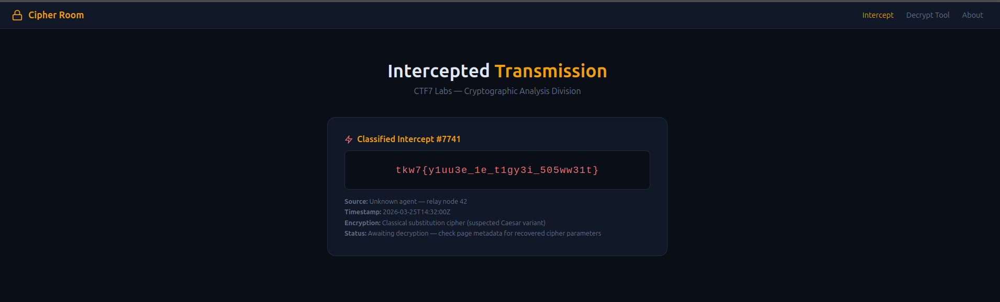
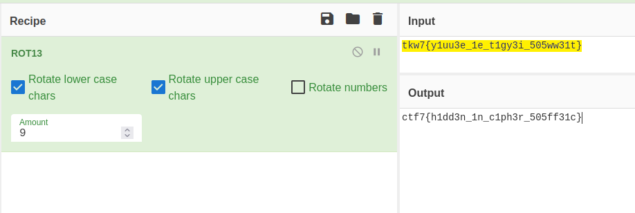

## **Challenge Overview**

**Name:** Cipher Room
**Category:** Cryptography
**Difficulty:** Easy
**Points**: 100

###### Challenge Description

CTF7 Labs' **Cipher Room** has intercepted an encrypted transmission from an unknown agent. The analysts identified the cipher type and even recovered the encryption parameters, but instead of putting them in the analysis report, they stashed them somewhere in the page itself. The decrypt tool is ready -- you just need the right inputs.

---

Upon visiting the page, we are given the ciphertext:

```
tkw7{y1uu3e_1e_t1gy3i_505ww31t}
```

At first glance:

- The format resembles a typical CTF flag
- However, it is clearly obfuscated

Paste the Found Text in CyberChef:


Apply ROT13 with amount 9:

**Flag:**
```
ctf7{h1dd3n_1n_c1ph3r_505ff31c}
```

---
