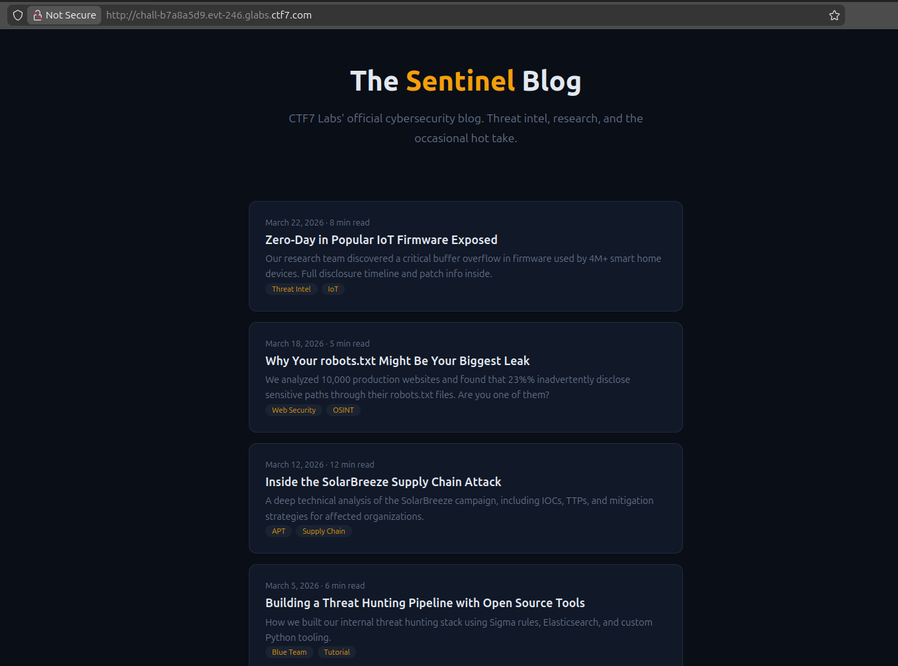
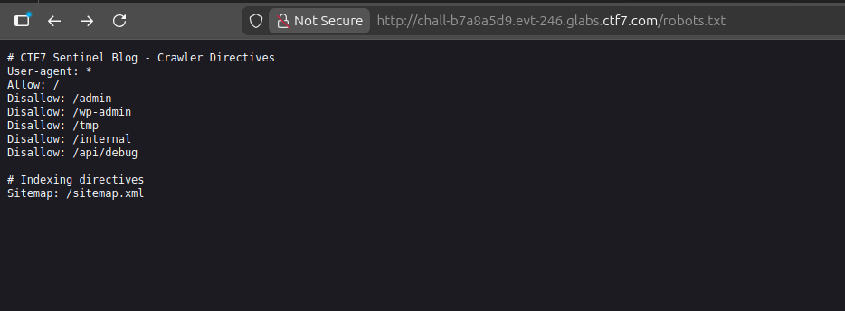
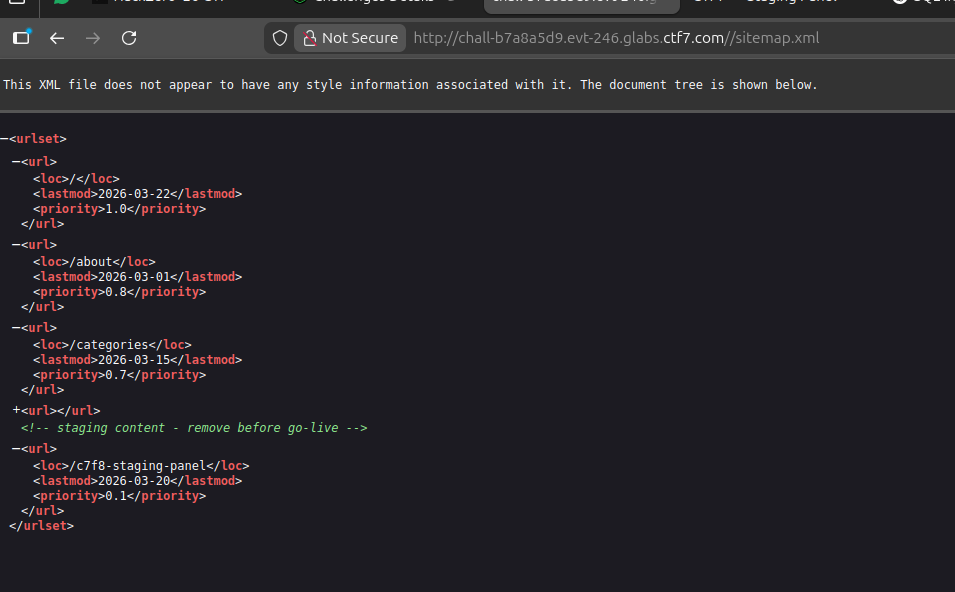
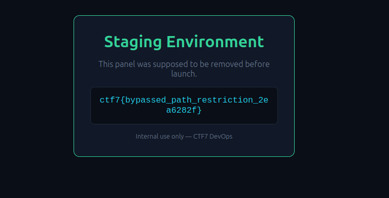

## **Challenge Overview**

**Name:** Disallowed Path
**Category:** Web  
**Difficulty:** Easy
**Points**: 100
###### Challenge Description

**The Sentinel** is CTF7 Labs' cybersecurity blog. They publish insightful articles about web security, threat intelligence, and OSINT techniques. Ironically, one of their own articles is about a common misconfiguration that leaks internal paths. Maybe they should take their own advice.

---


## **Initial Reconnaissance**

Upon visiting the application, we observe a standard blog interface with multiple posts related to cybersecurity topics such as:

- IoT vulnerabilities
- robots.txt misconfigurations
- Supply chain attacks
- Threat hunting

### Step 1: Inspect robots.txt

Accessing:
`http://chall-b7a8a5d9.evt-246.glabs.ctf7.com/robots.txt`



```
# CTF7 Sentinel Blog - Crawler Directives
User-agent: *
Allow: /
Disallow: /admin
Disallow: /wp-admin
Disallow: /tmp
Disallow: /internal
Disallow: /api/debug

# Indexing directives
Sitemap: /sitemap.xml
```

#### Enumerate Disallowed Paths
Testing the listed paths manually:
`http://chall-b7a8a5d9.evt-246.glabs.ctf7.com/sitemap.xml`

#### Find a hidden page in sitemap
visit: `/x7f8-staging-panel`

**Flah**

```
ctf7{bypassed_path_restriction_2ea6282f}
```

---
