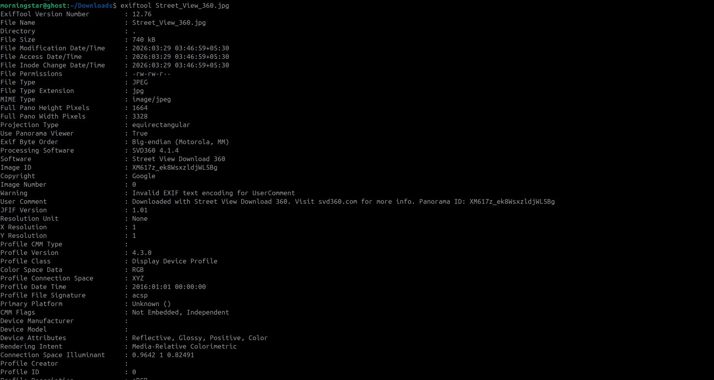
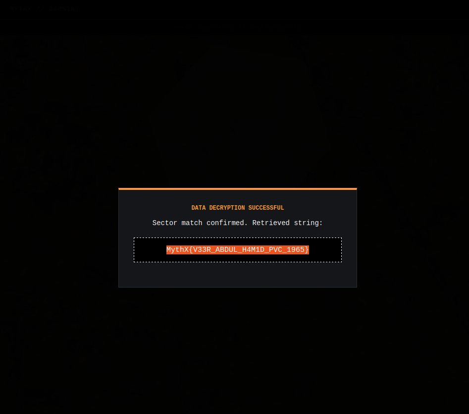

## **Challenge Overview**

**Name:** H an M Part 1
**Category:** OSINT  
**Difficulty:** Medium
**Points**: 700
###### Challenge Description

**"A single Hunter who stood against 7 giants. Find the Hunter's final rest."**

- **Intel**: [https://geosint.mythxofficial.online/chall](https://geosint.mythxofficial.online/chall)
    
- **Portal**: [https://geosint.mythxofficial.online](https://geosint.mythxofficial.online/)

---


Panorama ID: XM617z_ek8WsxzldjWL5Bg

## **Reconstruct Location**

Using the panoid:
```
https://maps.google.com/maps?q=&layer=c&cbll=0,0&panoid=XM617z_ek8WsxzldjWL5Bg
```


Submit The Location:


Flag: 
```
ctf7{h1dd3n_1n_c1ph3r_505ff31c}
```

---
