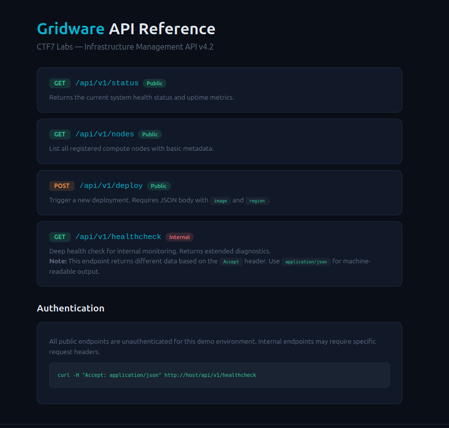

## **Challenge Overview**

**Name:** Header Hunter
**Category:** Web  
**Difficulty:** Easy
**Points**: 100

###### Challenge Description

**Gridware** by CTF7 Labs exposes a well-documented infrastructure management API. The documentation is thorough -- every endpoint is listed with usage notes and examples. One endpoint is labeled "Internal" and seems to behave differently depending on how you talk to it.

---

The challenge presents an API documentation page for **Gridware**, where one endpoint is marked as **Internal**:

```
GET /api/v1/healthcheck (Internal)
```

The description hints that this endpoint behaves differently depending on how requests are made—specifically mentioning the **`Accept` header**.


**Accept Header**
```
curl -H "Accept: application/json" \cation/json" \
http://chall-ee39f0fc.evt-246.glabs.ctf7.com/api/v1/healthcheck
```


**Response**
```
{"checks":{"cache":"connected","database":"connected","queue":"3 pending","storage":"94% available"},"debug":{"build":"4.2.0-rc3","commit":"a7f3c21","internal_token":"ctf7{p4ck3t_1ns1ght_70612887}"},"status":"healthy"}
```

Flag:
```
ctf7{p4ck3t_1ns1ght_70612887}
```

---
