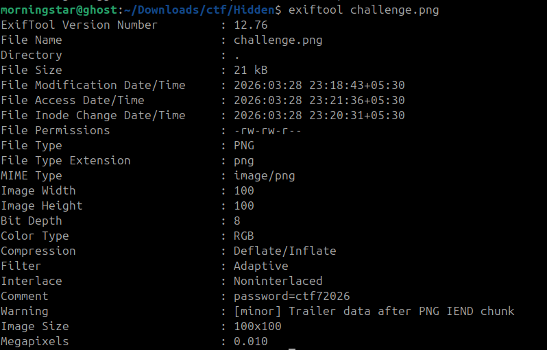
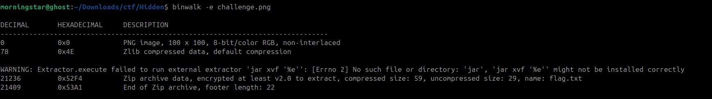

## **Challenge Overview**

**Name:**  Hidden ZIP in PNG
**Category:** Forensics  
**Difficulty:** Medium
**Points**: 300

###### Challenge Description

Digital forensics recovered an image file from a suspect's workstation. It renders as an ordinary gradient picture, but our analyst insists there is more to it than meets the eye. Sometimes the most interesting things are hiding just past the end. Examine the file carefully and extract whatever the suspect was trying to conceal.

---

### **File Inspection**

Using `exiftool`:
exiftool challenge.png
### **Key Findings**
- **Important clue:**

```
Comment: password=ctf72026  
Warning: Trailer data after PNG IEND chunk
```



## **Detect Embedded Data**

Using `binwalk`:

```
binwalk -e challenge.png
```




**Output Highlights**
```
21236  0x52F4  Zip archive data, encrypted, name: flag.txt
21409  0x53A1  End of Zip archive
```

## **Step 4: Decrypt the ZIP**

Using the password found in metadata:

```
unzip hidden.zip
```

Enter password:
```
ctf72026
```

Final Flag:

```
ctf7{zip_in_hidden_c8abd994}
```

---
