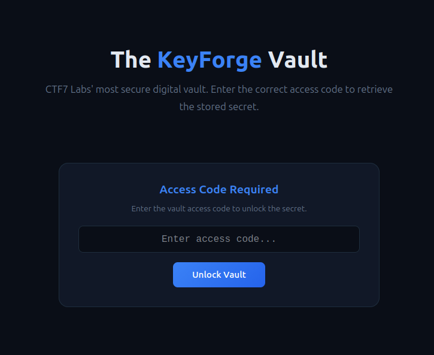
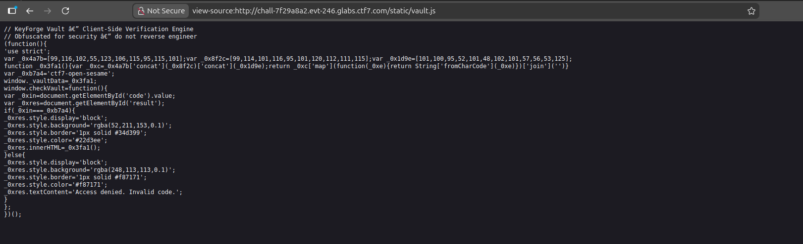

## **Challenge Overview**

**Name:** JS Vault
**Category:** Web  
**Difficulty:** Easy
**Points**: 100

###### Challenge Description

CTF7 Labs' **KeyForge** vault claims to be ultra-secure, protecting its stored secret behind a mysterious access code. The "About" page proudly describes their "cutting-edge security architecture." Can you retrieve the secret stored in the vault?


---

Visit The Website 

On Viewing Source code of the Website
i found a vault.js file of javascript:



It Contain Some Arrays of numbers 
### First array:

[99,116,102,55,123,106,115,95,115,101]  
→ "ctf7{js_se"

### Second array:

[99,114,101,116,95,101,120,112,111,115]  
→ "cret_expos"

### Third array:

[101,100,95,52,101,48,102,101,57,56,53,125]  
→ "ed_4e0fe985}"

### Final Flag
```
ctf7{js_secret_exposed_4e0fe985}
```

---
