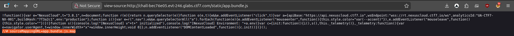
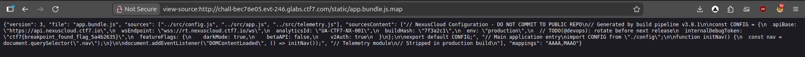

## **Challenge Overview**

**Name:** Source Dive
**Category:**   web
**Difficulty:** easy
**Points**: 100

###### Challenge Description

CTF7 Labs just launched **NexusCloud**, their sleek new cloud infrastructure platform. The marketing site looks polished and production-ready, but their engineering team may have shipped a little more than they intended. Poke around the frontend assets and see what you can find.

---

### **Inspect JavaScript Bundle**

Accessing the main JavaScript file:
http://chall-bec76e05.evt-246.glabs.ctf7.com/static/app.bundle.js



```
//# sourceMappingURL=app.bundle.js.map
```

view-source:http://chall-bec76e05.evt-246.glabs.ctf7.com/static/app.bundle.js.map


Flag:
```
ctf7{breakpoint_found_flag_5a4b2635}
```

---
