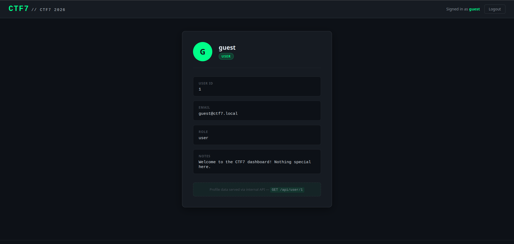
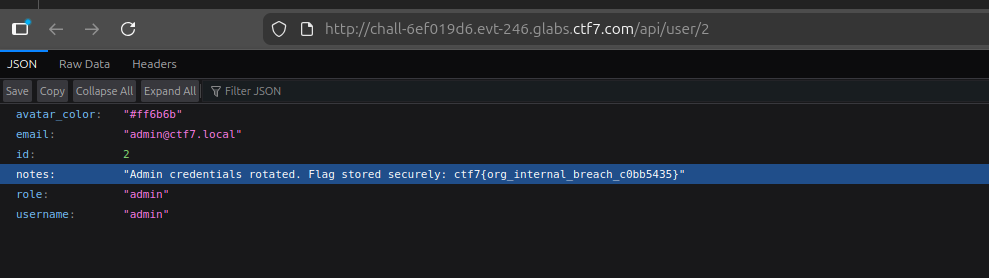

## **Challenge Overview**

**Name:** Staff Dashboard
**Category:** Web Exploitation  
**Difficulty:** Medium
**Points**: 350

###### Challenge Description

Welcome to the CTF7 Staff Dashboard -- a brand-new internal portal where every team member gets their own profile with private notes and a personalized workspace. We have already provisioned a guest account so you can explore the interface.

The admin assures us that user data is properly isolated. Can you verify that claim?

**Guest credentials:** `guest` / `guest123`

---
After logging in with the provided credentials:

Username: guest    
Password: guest123

We are presented with a user dashboard displaying:

- User ID: `1`
- Email: `guest@ctf7.local`
- Role: `user`
- Notes: Basic welcome message


At the bottom of the dashboard:
Profile data served via internal API — GET /api/user/1

### **Insecure Direct Object Reference (IDOR)**

The endpoint:

`GET /api/user/<id>`

Modify User ID


"Admin credentials rotated. Flag stored securely: ctf7{org_internal_breach_c0bb5435}"

**Flag:**
```
ctf7{org_internal_breach_c0bb5435}
```

---
