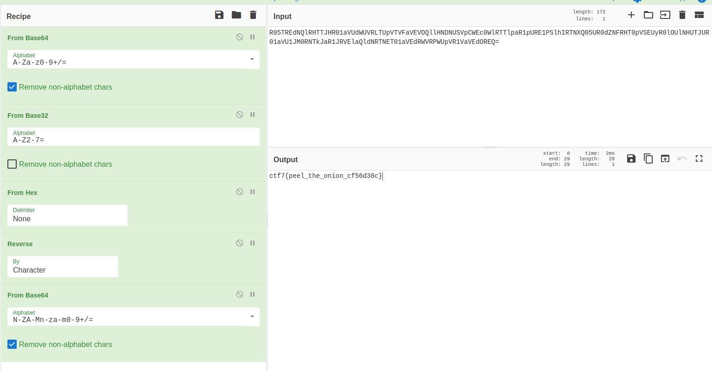

## **Challenge Overview**

**Name:** The Encoding Onion
**Category:** Other  
**Difficulty:** Medium
**Points**: 300

###### Challenge Description

Our intelligence team intercepted a suspicious data transmission from an underground network. The message appears to be wrapped in multiple layers of obfuscation. The operative who encoded it was meticulous -- every layer must be peeled back in the correct order to reveal the original content.

Connect to the service and retrieve the encoded payload. Can you unwrap it?

---

on visiting the website:
```
Welcome to the Encoding Onion Challenge!
Peel back the layers to find the flag.
Layers (outer to inner): base64 -> base32 -> hex -> ROT13 -> reverse -> base64
encoded_data = R05TREdNQlRHTTJHR01aVUdWUVRLTUpVTVFaVEVOQllHNDNUSVpCWEc0WlRTTlpaR1pURE1PSlhIRTNXQ05UR0dZNFRHT0pVSEUyR0lOUlNHUTJUR01aVU1JM0RNTkJaR1JRVElaQldNRTNET01aVEdRWVRPWUpVR1VaVEdOREQ=
```
`base64 → base32 → hex → ROT13 → reverse → base64`



Flag:
```
ctf7{peel_the_onion_cf56d38c}
```

---
