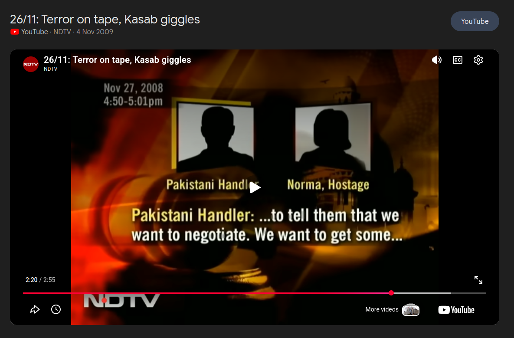

## **Challenge Overview**

**Name:** Two-Point-ThreeSix
**Category:** OSINT  
**Difficulty:** Medium
**Points**: 500


###### Challenge Description

A recording survives.  
Listen carefully.

Determine:  
The name of the female voice (as identified in public records)  
The real-world start and end time of the recording (IST)  
The date on which the recording took place

Flag format: MythX{JohnDoe_hhmm_hhmm_ddmmyyyy}  
  
Recording: https://drive.google.com/file/d/1nPWRNjkS2f9K9DV8s8KeV0L-Z4LuUnjo

---
Listening to the recording reveals:

- A **tense conversation**
- Presence of a **male handler** giving instructions
- A **female voice responding under distress**
- Strong **South Asian (Pakistani) accent cues**

### **Initial Inference**

- Likely linked to a **terrorist incident**
- Suggests **real-world historical event**
### **Breakthrough**

This leads to the **2008 Mumbai (26/11) attacks**, where:
- Terrorists were in contact with handlers

**“26/11: Terror on tape, Kasab giggles” (NDTV)**
(https://www.youtube.com/watch?v=IIo0c16TPwg)

## **Identify the Female Voice**

From the video and transcripts:
- The female hostage is identified as:

```
Norma
```
## **Extract Timeline**

From the video overlay:
```
Nov 27, 2008    
4:50 – 5:01 PM
```
### **Convert to Required Format (IST)**

```
- Start time: `16:50` → `1650`
- End time: `17:01` → `1701`
- Date: `27/11/2008` → `27112008`
```



Flag:
```
MythX{Norma_1650_1701_27112008}
```

---
