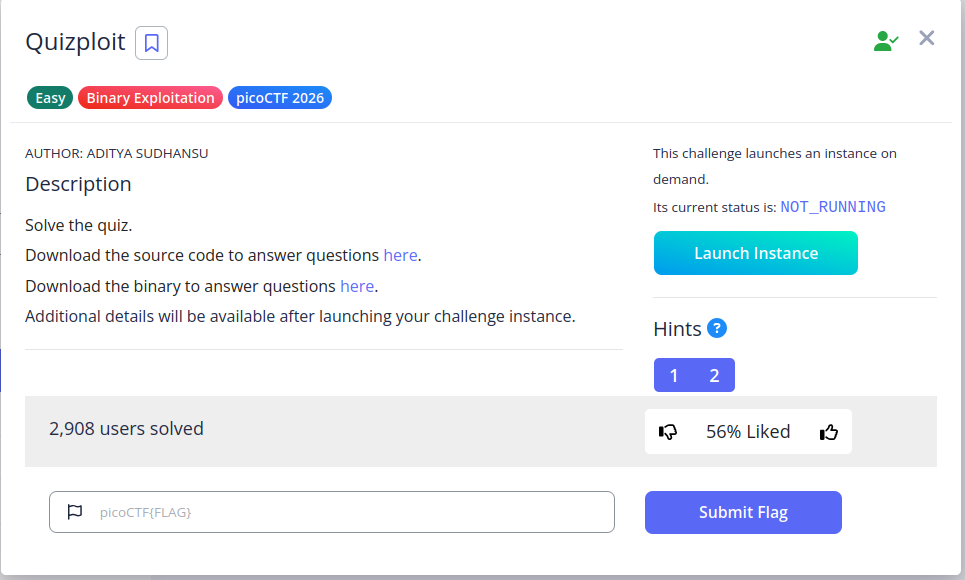

---

# ELF Binary Analysis Quiz — CTF Writeup

## Challenge Overview

This challenge is a beginner-friendly binary exploitation task focused on analyzing an ELF binary and identifying vulnerabilities through static analysis.

The objective is to:

- Analyze the binary properties
    
- Understand protections
    
- Identify vulnerabilities
    
- Answer a set of questions to retrieve the flag
    

---

## Binary Information

Using the `file` command:

```bash
file vuln
```

Output:

```
vuln: ELF 64-bit LSB executable, x86-64, dynamically linked, not stripped
```

### Key Observations

- Architecture: **64-bit**
    
- Linking: **Dynamically linked**
    
- Stripping: **Not stripped**
    
- Interpreter: `/lib64/ld-linux-x86-64.so.2`
    

---

## Source Code Analysis

```c
#include <stdio.h>
#include <stdlib.h>

void win(){
    system("cat flag.txt");
}

void vuln(){
    char buffer[0x15] = {0};
    fprintf(stdout, "\nEnter payload: ");
    fgets(buffer, 0x90, stdin);
}

void main(){
    vuln();
}
```

### Important Points

1. **Buffer Size**
    
    ```c
    char buffer[0x15];
    ```
    
    - Buffer size: **0x15 (21 bytes)**
        
2. **Input Size**
    
    ```c
    fgets(buffer, 0x90, stdin);
    ```
    
    - Reads: **0x90 (144 bytes)**
        
3. **Hidden Function**
    
    ```c
    void win(){
        system("cat flag.txt");
    }
    ```
    
    - Not called anywhere in the program
        
    - Ideal exploitation target
        

---

## Vulnerability Analysis

### Buffer Overflow

- Buffer size: `0x15`
    
- Input size: `0x90`
    

**Overflow size:**

```
0x90 - 0x15 = 0x7B bytes
```

This confirms a **stack-based buffer overflow vulnerability**.

---

## Function Discovery

```bash
objdump -d vuln | grep win
```

Output:

```
0000000000401176 <win>:
```

- Address of `win()`: **0x401176**
    

---

## Security Protections

Using `checksec`:

- NX: **Enabled**
    
- Stack Canary: Not mentioned (likely disabled)
    
- PIE: Not mentioned
    
- RELRO: Not mentioned
    

### Implication

- NX prevents execution of injected shellcode
    
- Exploitation must use **ROP (Return-Oriented Programming)**
    

---

## Exploitation Strategy

1. Trigger buffer overflow
    
2. Overwrite return address
    
3. Redirect execution to `win()`
    

Since NX is enabled:

- Direct shellcode injection is not viable
    
- Use **ret2win / ROP technique**
    


```
 nc lonely-island.picoctf.net 60397
```

```
=========================================================================================================
                                   ELF BINARY ANALYSIS QUIZ
=========================================================================================================


◉◉◉◉◉◉◉◉◉◉◉◉◉◉◉◉◉◉◉◉◉◉◉◉◉◉◉◉◉◉◉◉◉◉◉◉◉◉◉◉◉◉◉◉◉◉◉◉◉◉◉◉◉◉◉◉◉◉◉◉◉◉◉◉◉◉◉◉◉◉◉◉◉◉◉◉◉◉◉◉◉◉◉◉◉◉◉◉◉◉◉◉◉◉◉◉◉◉◉◉◉◉◉◉◉
◉                                                                                                       ◉
◉  This is a simple questionnaire to analyze the binary characteristics.                                ◉
◉                                                                                                       ◉
◉  When compiling C/C++ source code in Linux, an ELF (Executable and Linkable Format) file is           ◉
◉  created. The flags added when compiling can affect the binary in various ways, like the              ◉
◉  protections.                                                                                         ◉
◉                                                                                                       ◉
◉  Dynamic Linking:                                                                                     ◉
◉  Dynamic linking is a process where a program uses external code libraries (called shared             ◉
◉  libraries or dynamic link libraries) that are loaded into memory at runtime, rather than             ◉
◉  being built directly into the executable file.                                                       ◉
◉                                                                                                       ◉
◉  Static Linking:                                                                                      ◉
◉  The code for all the routines called by your program becomes part of the executable file.            ◉
◉                                                                                                       ◉
◉  Stripped:                                                                                            ◉
◉  The binary does not contain debugging information which can be used with debuggers                   ◉
◉  like GDB.                                                                                            ◉
◉                                                                                                       ◉
◉  Non Stripped:                                                                                        ◉
◉  The binary contains no debuggig information which makes it difficult for analysis.                   ◉
◉                                                                                                       ◉
◉  Canary: A random/specific value which is stored on the stack for protection against                  ◉
◉  buffer overflow.                                                                                     ◉
◉                                                                                                       ◉
◉  Run 'file' and 'checksec' commands on the binary to answer the questions.                            ◉
◉                                                                                                       ◉
◉  Find out what are 'pwntools' and how can this library be used for exploit creation.                  ◉
◉                                                                                                       ◉
◉  To run the binary: chmod +x ./vuln , followed by ./vuln                                              ◉
◉                                                                                                       ◉
◉  Analyze the provided C program and the corresponding binary to answer the questions.                 ◉
◉                                                                                                       ◉
◉  Answer the questions about this binary to get the flag.                                              ◉
◉                                                                                                       ◉
◉◉◉◉◉◉◉◉◉◉◉◉◉◉◉◉◉◉◉◉◉◉◉◉◉◉◉◉◉◉◉◉◉◉◉◉◉◉◉◉◉◉◉◉◉◉◉◉◉◉◉◉◉◉◉◉◉◉◉◉◉◉◉◉◉◉◉◉◉◉◉◉◉◉◉◉◉◉◉◉◉◉◉◉◉◉◉◉◉◉◉◉◉◉◉◉◉◉◉◉◉◉◉◉◉

[*] Question number 0x1:

Is this a '32-bit' or '64-bit' ELF? (e.g. 100-bit)

💡 Hint: Check if the system is x86_64 or x86. No compilation flag specified means default.

>> 64-bit


✅ ✅ ✅ ✅ ✅ ✅ ✅ ✅ 
✅                    ✅
✅      Correct!      ✅
✅                    ✅
✅ ✅ ✅ ✅ ✅ ✅ ✅ ✅ 


[*] Question number 0x2:

What's the linking of the binary? (e.g. static, dynamic)

💡 Hint: The program uses standard library functions like fprintf, fgets, and system.

>> dynamic


✅ ✅ ✅ ✅ ✅ ✅ ✅ ✅ 
✅                    ✅
✅      Correct!      ✅
✅                    ✅
✅ ✅ ✅ ✅ ✅ ✅ ✅ ✅ 


[*] Question number 0x3:

Is the binary 'stripped' or 'not stripped'?

💡 Hint: By default, binaries compiled without the -s flag contain debugging symbols.

>> not stripped


✅ ✅ ✅ ✅ ✅ ✅ ✅ ✅ 
✅                    ✅
✅      Correct!      ✅
✅                    ✅
✅ ✅ ✅ ✅ ✅ ✅ ✅ ✅ 


[*] Question number 0x4:

Looking at the vuln() function, what is the size of the buffer in bytes? (e.g. 0x10)

💡 Hint: Check the declaration in the function and answer in either hex or decimal

>> 0x15


✅ ✅ ✅ ✅ ✅ ✅ ✅ ✅ 
✅                    ✅
✅      Correct!      ✅
✅                    ✅
✅ ✅ ✅ ✅ ✅ ✅ ✅ ✅ 


[*] Question number 0x5:

How many bytes are read into the buffer? (e.g. 0x10)

💡 Hint: Check the fgets

>> 0x90


✅ ✅ ✅ ✅ ✅ ✅ ✅ ✅ 
✅                    ✅
✅      Correct!      ✅
✅                    ✅
✅ ✅ ✅ ✅ ✅ ✅ ✅ ✅ 


[*] Question number 0x6:

Is there a buffer overflow vulnerability? (yes/no)

💡 Hint: Compare buffer size and input size

>> yes


✅ ✅ ✅ ✅ ✅ ✅ ✅ ✅ 
✅                    ✅
✅      Correct!      ✅
✅                    ✅
✅ ✅ ✅ ✅ ✅ ✅ ✅ ✅ 


[*] Question number 0x7:

Name a standard C function that could cause a buffer overflow in the provided C code.

💡 Hint: (e.g. fprintf)

>> fgets


✅ ✅ ✅ ✅ ✅ ✅ ✅ ✅ 
✅                    ✅
✅      Correct!      ✅
✅                    ✅
✅ ✅ ✅ ✅ ✅ ✅ ✅ ✅ 


[*] Question number 0x8:

What is the name of function which is not called any where in the program?

💡 Hint: Analyze the source

>> win


✅ ✅ ✅ ✅ ✅ ✅ ✅ ✅ 
✅                    ✅
✅      Correct!      ✅
✅                    ✅
✅ ✅ ✅ ✅ ✅ ✅ ✅ ✅ 


[*] Question number 0x9:

What type of attack could exploit this vulnerability? (e.g. format string, buffer overflow, etc.)

💡 Hint: Try interpreting the information gathered so far

>> buffer overflow


✅ ✅ ✅ ✅ ✅ ✅ ✅ ✅ 
✅                    ✅
✅      Correct!      ✅
✅                    ✅
✅ ✅ ✅ ✅ ✅ ✅ ✅ ✅ 


[*] Question number 0xa:

How many bytes of overflow are possible? (e.g. 0x10)

💡 Hint: Subtract values

>> 0x7B


✅ ✅ ✅ ✅ ✅ ✅ ✅ ✅ 
✅                    ✅
✅      Correct!      ✅
✅                    ✅
✅ ✅ ✅ ✅ ✅ ✅ ✅ ✅ 


[*] Question number 0xb:

What protection is enabled in this binary?

💡 Hint: Learn to use checksec

>> nx


✅ ✅ ✅ ✅ ✅ ✅ ✅ ✅ 
✅                    ✅
✅      Correct!      ✅
✅                    ✅
✅ ✅ ✅ ✅ ✅ ✅ ✅ ✅ 


[*] Question number 0xc:

What exploitation technique could bypass NX? (e.g. shellcode, ROP, format string)

💡 Hint: Choose from the options

>> ROP


✅ ✅ ✅ ✅ ✅ ✅ ✅ ✅ 
✅                    ✅
✅      Correct!      ✅
✅                    ✅
✅ ✅ ✅ ✅ ✅ ✅ ✅ ✅ 


[*] Question number 0xd:

What is the address of 'win()' in hex? (e.g. 0x4011eb)

💡 Hint: Use gdb/objdump to find the address

>> 0x401176


✅ ✅ ✅ ✅ ✅ ✅ ✅ ✅ 
✅                    ✅
✅      Correct!      ✅
✅                    ✅
✅ ✅ ✅ ✅ ✅ ✅ ✅ ✅ 


=========================================================================================================
QUIZ COMPLETE!
=========================================================================================================

🎉 PERFECT SCORE! 🎉
You got 13/13 questions correct!

Flag: picoCTF{my_bIn@4y_3xpl0it_fL@g_0235704f}

=========================================================================================================
```

---

## Quiz Answers Summary

|Question|Answer|
|---|---|
|1|64-bit|
|2|dynamic|
|3|not stripped|
|4|0x15|
|5|0x90|
|6|yes|
|7|fgets|
|8|win|
|9|buffer overflow|
|10|0x7B|
|11|nx|
|12|ROP|
|13|0x401176|

---
### Flag

```
picoCTF{my_bIn@4y_3xpl0it_fL@g_0235704f}
```

---

## Key Takeaways

- Always compare buffer size vs input size
    
- Hidden functions like `win()` are common exploitation targets
    
- NX changes exploitation strategy (forces ROP)
    
- Tools like `file`, `objdump`, and `checksec` are essential
    
---

## 🧑‍💻 Author

Morningstar- Cybersecurity Learner & CTF Player