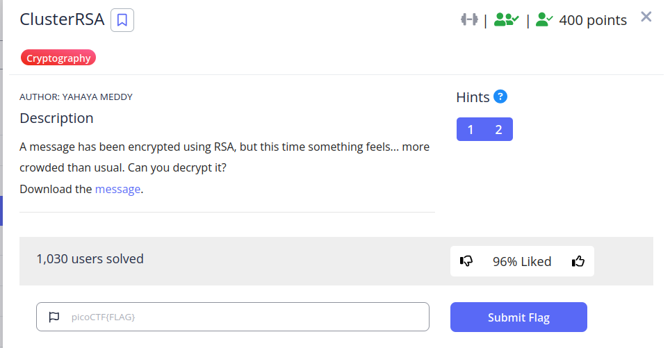
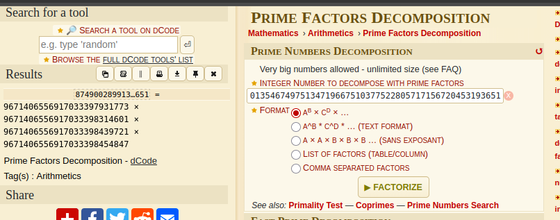

```
n = 8749002899132047699790752490331099938058737706735201354674975134719667510377522805717156720453193651
e = 65537
ct = 3891158515405030211396309867177046660195995913985068178988858029936868358096672572274111514200511662
```

```
9671406556917033397931773 × 9671406556917033398314601 × 9671406556917033398439721 × 9671406556917033398454847
```



```python
from Crypto.Util.number import long_to_bytes, inverse

# Challenge parameters
n = 8749002899132047699790752490331099938058737706735201354674975134719667510377522805717156720453193651
e = 65537
ct = 3891158515405030211396309867177046660195995913985068178988858029936868358096672572274111514200511662

# The four prime factors you found
primes = [
    9671406556917033397931773,
    9671406556917033398314601,
    9671406556917033398439721,
    9671406556917033398454847
]

# 1. Calculate the totient: phi(n)
phi = 1
for p in primes:
    phi *= (p - 1)

# 2. Calculate the private key: d
d = inverse(e, phi)

# 3. Decrypt the ciphertext: pt = ct^d mod n
pt = pow(ct, d, n)

# 4. Convert the resulting integer back to a text string
flag = long_to_bytes(pt)
print("[+] Decrypted Flag:", flag.decode(errors='ignore'))
```

```
picoCTF{mul71_rsa_0f2cedbf}
```

---
