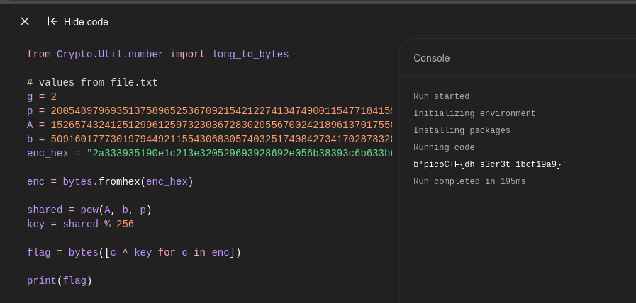

```python
from Crypto.Util.number import long_to_bytes

# values from file.txt
g = 2
p = 2005489796935137589652536709215421227413474900115477184159288806231355361156176092738144739229061781181971004837450663600551455172191607683499761945041310094230762983233445086539060376536215287058683085224035132476464249207769338765992833263445688154729139951250856419569393037160760491967282844274908611640892128679
A = 1526574324125129961259732303672830205567002421896137017558571535529215675316133764444378654529707594836188982394472034540864660242977636029339047981723895375524563630100300655200283785469049344595714244458406039282974302326790358153264672424068532715352717858828829208557783552820903870187525422507969621522576128529
b = 509160177730197944921155430683057403251740842734170287832867942540738055861009944443738638587125553292842157324977185671585742050562430030882589659241602138008956713608431696199507406174765901469913371166897127354209889596259884458927157926821014407437019772163790129553017138635328607276432132415865673419672072309
enc_hex = "2a333935190e1c213e320529693928692e056b38393c6b633b6327"

enc = bytes.fromhex(enc_hex)

shared = pow(A, b, p)
key = shared % 256

flag = bytes([c ^ key for c in enc])

print(flag)
```



```
picoCTF{dh_s3cr3t_1bcf19a9}
```

---
