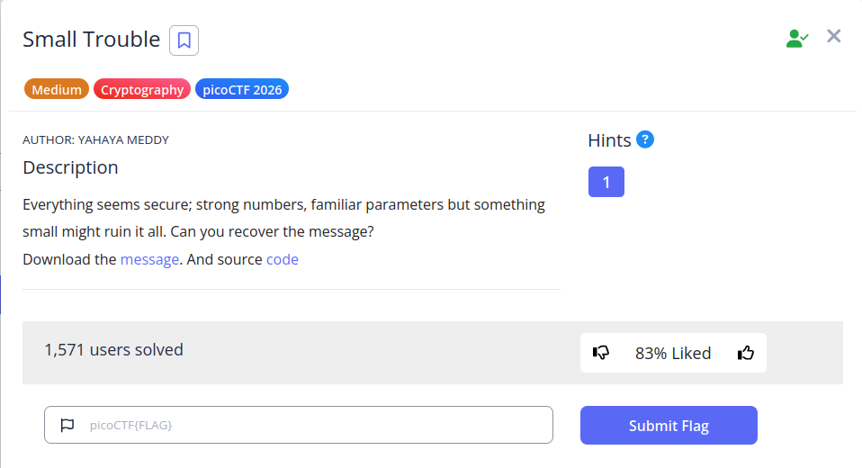

```python
from Crypto.Util.number import getPrime, inverse, bytes_to_long
import random

# Generate two large primes (1048 bits each)
p = getPrime(1048)
q = getPrime(1048)
n = p * q
phi = (p - 1) * (q - 1)

# compute d
d = getPrime(256)

# Compute the public exponent
e = inverse(d, phi)

# Encrypt a flag
flag = b'picoCTF{...}'
m = bytes_to_long(flag)
c = pow(m, e, n)

# Output for the challenge
with open("message.txt", "w") as f:
    f.write(f"n = {n}\n")
    f.write(f"e = {e}\n")
    f.write(f"c = {c}\n")
```

```
n = 4053230256051842378902093204190359856170315545230254756873712124780217306961965538219550234465834179796540757514103635761890523386100132020232863908279611678064927236757285482362586155649463886095154300107296546912006103176093900393877473665623301977706741206542768918103065544446628377962790578547607687393512503773146419440377885006947331025961809490926862380151416494754228553438840052044648290733417727639418585516527937849542580367721008435846152257596809228093525539257109075301808396175835500878255948634428469076292187098795271966264588674687007423151235788368264405046525813287682492487036877438300349058185599929500338721
e = 1108871084183718316402407931192759031060730933398426093844228945280428702507453337140030450256939778916290618499943691637993645783104178712155033136292665204049375340326092945957122248364574742413666500345289427752965331307611572493304791669908053784616299559017315061304639577075274905439403564207103978941728188525724841290251738121472377064038015630310551255441470668966544393825262302266715645683620450100868283925485797776985416741280595125454218498857659556818930258260745293146275391090535494449461298348442288037765312218040163218797520742545695470586210401212454355512648195042758720818489235483802867140447298331458061317
c = 3343111376870711690113071361029311473012066074345143301907919688123084858842239488442197174681094903472975888154299354656749547470126058265471791277256882618259649067332670725891155005365043291108002981434727271592322414339604415845626475806783232513509632662318291237769053436307612750172851955186498554494826240276972789790505530442899243627997646693479728691350485037340065695513205177761465942977891508753794360590598304387654188534096206423084190795849928334819502586016078741876956199493015380695874491636078308313595538788364166958491593055725350093934354467907338002357697875196248320130092354711697572207718931942895781814
```

```python
from Crypto.Util.number import long_to_bytes
from sympy import Rational
from sympy.ntheory.continued_fraction import continued_fraction, continued_fraction_convergents
import math

n = ..........
e = ..........
c = ..........
cf = continued_fraction(Rational(e, n))
convergents = continued_fraction_convergents(cf)

for frac in convergents:
    k = frac.p
    d = frac.q

    if k == 0:
        continue

    if (e*d - 1) % k != 0:
        continue

    phi = (e*d - 1) // k
    s = n - phi + 1
    discr = s*s - 4*n

    if discr >= 0:
        t = math.isqrt(discr)
        if t*t == discr:
            print("[+] Found d:", d)
            m = pow(c, d, n)
            print(long_to_bytes(m))
            break
```

```
picoCTF{sm4ll_d_57cacc98}
```

---
