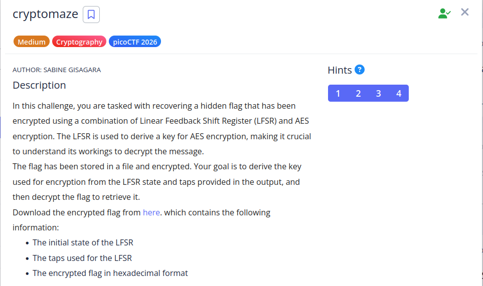

```
hint:
1. Use the LFSR’s initial state and taps to generate a 128-bit sequence.
2. Convert this 128-bit sequence into a 16-byte AES key by:
	- Grouping the bits into 8-bit chunks (16 chunks in total).
	- Converting each chunk from binary to a byte to form the AES key.
3. Decrypt the flag using AES in ECB mode.
4. Convert the encrypted flag from hex to bytes before decrypting.
```

```python
from Crypto.Cipher import AES

state = [0,0,1,0,0,1,0,1,1,1,1,0,1,1,0,0,1,0,0,1,0,1,1,0,1,0,0,1,0,1,0,1,
         0,1,0,0,1,1,0,1,1,0,0,0,1,0,1,1,1,1,0,0,0,1,0,0,0,1,0,1,1,0,1,1]

taps = [63,61,60,58]

enc = bytes.fromhex(
"8f0e6d0f5b0dc1db201948b9e0cebd8f4e0f7cb6a86d4243f62f1438e07a632c38338e7e04fbddef0c6260a4eb758417"
)

def step(state):
    out = state[0]
    new = state[63] ^ state[61] ^ state[60] ^ state[58]
    state = state[1:] + [new]
    return out, state

bits = []

for _ in range(128):
    b, state = step(state)
    bits.append(b)

key = bytearray()

for i in range(0,128,8):
    byte = 0
    for j in range(8):
        byte = (byte << 1) | bits[i+j]
    key.append(byte)

key = bytes(key)

print("AES key:", key.hex())

cipher = AES.new(key, AES.MODE_ECB)

flag = cipher.decrypt(enc)

print(flag)
```

```
picoCTF{scr8mbledt_flvg_35821959}
```

---
