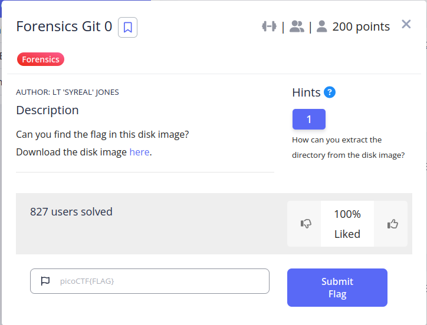

```
 mmls disk.img
DOS Partition Table
Offset Sector: 0
Units are in 512-byte sectors
```

```
  Slot      Start        End          Length       Description
000:  Meta      0000000000   0000000000   0000000001   Primary Table (#0)
001:  -------   0000000000   0000002047   0000002048   Unallocated
002:  000:000   0000002048   0000616447   0000614400   Linux (0x83)
003:  000:001   0000616448   0001140735   0000524288   Linux Swap / Solaris x86 (0x82)
004:  000:002   0001140736   0002097151   0000956416   Linux (0x83)
```

```
sudo mount -o loop,offset=$((1140736*512)) disk.img mount
```

```
tree -a home/
home/
└── ctf-player
    └── Code
        └── secrets
            ├── .git
            ....
            ....
            └── note.txt

20 directories, 26 files
```

```
cat home/ctf-player/Code/secrets/note.txt
The picoCTF flag format is 'picoCTF{}' where there is some leetspeak phrase in between the curly braces

```


move to `home/ctf-player/Code/secrets/.git`
```
git log
commit 327681bb38cf467cec328eec9707b240e3e74ced (HEAD -> master)
Author: ctf-player <ctf-player@example.com>
Date:   Wed Nov 19 08:49:27 2025 +0000

    Wrap this phrase in the flag format: g17_1n_7h3_d15k_041217d8
```

```
picoCTF{g17_1n_7h3_d15k_041217d8}
```

---
