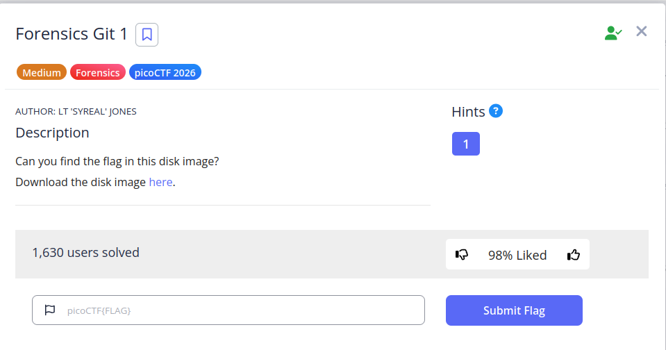

```
mmls disk2.img 
DOS Partition Table
Offset Sector: 0
Units are in 512-byte sectors
```

```
Slot      Start        End          Length       Description
000:  Meta      0000000000   0000000000   0000000001   Primary Table (#0)
001:  -------   0000000000   0000002047   0000002048   Unallocated
002:  000:000   0000002048   0000616447   0000614400   Linux (0x83)
003:  000:001   0000616448   0001140735   0000524288   Linux Swap / Solaris x86 (0x82)
004:  000:002   0001140736   0002097151   0000956416   Linux (0x83)

```

```
sudo mount -o loop,offset=$((1140736*512)) disk2.img mount
```

```
cd mount/home/ctf-player/Code/secrets/.git/
```


```
picoCTF{g17_r3m3mb3r5_d4ddf904}
```

---
