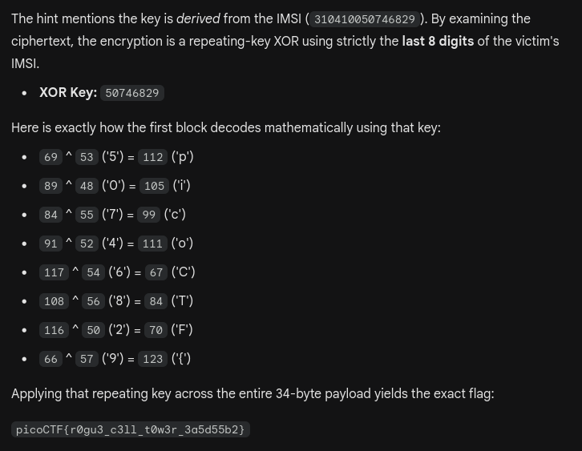

```
hints: 
1. Look for unauthorized test network broadcasts on UDP port 55000
2. Find the device that connected to the rogue tower by checking HTTP User-Agent headers
3. The encryption key is derived from the victim device's IMSI
4. The exfiltrated data is split across multiple HTTP POST requests
```


`UNAUTHORIZED-TEST-NETWORK PLMN=00101 CELLID=91521`

```
PLMN = 00101
CELLID = 91521
```

`User-Agent: MobileDevice/1.0 (IMSI:310410050746829; CELL:91521)`

```
310410050746829
```

```
tshark -r rogue_tower.pcap -Y "http.request.method==POST" -T fields -e data
52566c555733567364
454a48414642424257
6452436c6c63614541
475477464c61674e57
4156494e4231734854
513d3d
```

```
52566c555733567364454a484146424242576452436c6c63614541475477464c61674e574156494e4231734854513d3d --> RVlUW3VsdEJHAFBBBWdRCllcaEAGTwFLagNWAVINB1sHTQ==
```


```
picoCTF{r0gu3_c3ll_t0w3r_3a5d55b2}
```

---