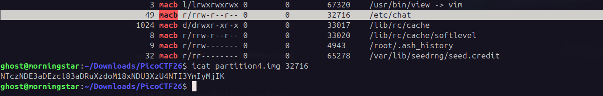

```
Hints:
1. Create a Sleuthkit MAC timeline!
2. Look at recent timestamps
3. Pay close attention to timestamps near an anti-forensic action
4. Filter only new files by grepping for `macb`
```


First create a **bodyfile** using `fls`.

```bash
fls -r -m / partition4.img > bodyfile.txt
```

Then generate a **MAC timeline** using `mactime`.

```bash
mactime -b bodyfile.txt > timeline.txt
```

MAC timeline shows file activity based on:

- **M** → Modified
- **A** → Accessed
- **C** → Metadata changed
- **B** → Birth/creation


grep macb timeline.txt



NTczNDE3aDEzcl83aDRuXzdoM18xNDU3XzU4NTI3YmIyMjIK --> 573417h13r_7h4n_7h3_1457_58527bb222

```
picoCTF{573417h13r_7h4n_7h3_1457_58527bb222}
```

---
