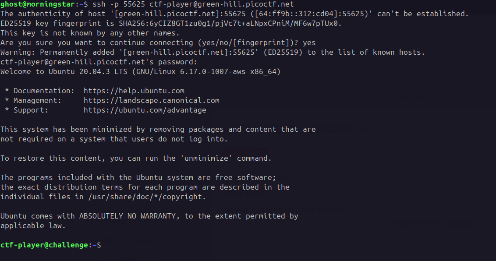
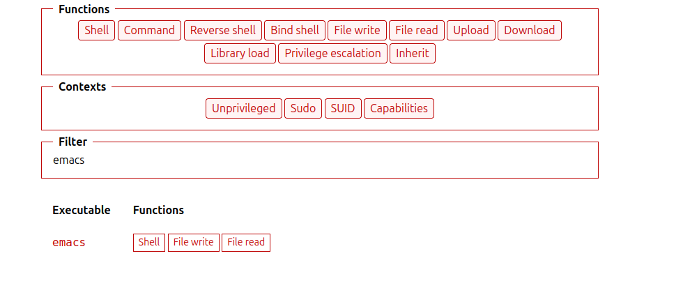
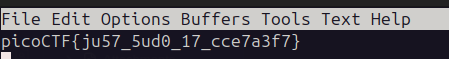

```
Description
Can you read the flag? I think you can! 
`ssh -p 55625 ctf-player@green-hill.picoctf.net` using password `deebe023`
```





```exploit
sudo /bin/emacs flag.txt
```



```
picoCTF{ju57_5ud0_17_cce7a3f7}
```

---
