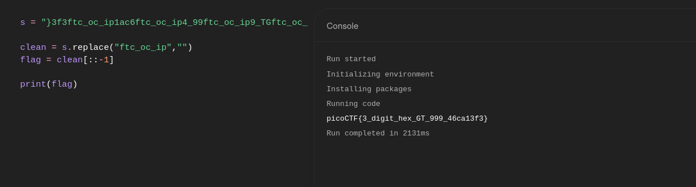

#### Hints

The program’s output isn’t straightforward; reversing the string and cleaning out extra text may help you recover the flag.

```
USE {https://dogbolt.org}
DECODE the executable and convert the code into human readable format using chatGPT
```

```python
main() {

    print("Enter numeric code > 999:");

    input = read_string();

    if input is decimal
        value = atoi(input)

    else if input is hex
        value = hex_to_int(input)

    else
        print("Invalid input")
        exit

    if value < 1000
        print("Too small")

    else if value < 10000
        if length(input) == 3
            reveal_flag()
        else
            print("Access Denied")

    else
        print("Too high")
}
```

The **critical check is:**
value must be between 1000 and 9999  
AND  
input length must be exactly 3
But **3 decimal digits cannot reach 1000**.

Example: 999 max
So decimal cannot pass.
But **hex can**.

Example: "3e8"

Length: 3 characters
Hex value: 3e8 = 1000

This **bypasses the check**.

```
nc green-hill.picoctf.net 64693
Enter a numeric code (must be > 999 ): 3e8
Access granted: }3f3ftc_oc_ip1ac6ftc_oc_ip4_99ftc_oc_ip9_TGftc_oc_ip_xehftc_oc_ip_tigftc_oc_ipid_3ftc_oc_ip{FTCftc_oc_ipocipftc_oc_ip
```


```
}3f3ftc_oc_ip1ac6ftc_oc_ip4_99ftc_oc_ip9_TGftc_oc_ip_xehftc_oc_ip_tigftc_oc_ipid_3ftc_oc_ip{FTCftc_oc_ipocipftc_oc_ip
```



```
picoCTF{3_digit_hex_GT_999_46ca13f3}
```

---
