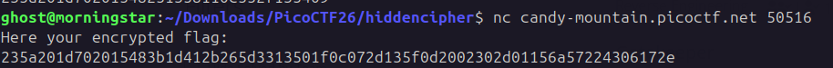

```
#### Hints
The binary can be unpacked using a tool that's often pre-installed on Linux
The program hides a secret. Look at how it's defined and used.
Think XOR. What happens when you XOR something twice with the same key?
```

```cpp
#include <stdio.h>
#include <stdlib.h>
#include <string.h>

char *get_key() {
    return "S3Cr3t";
}

int main() {

    FILE *fp = fopen("flag.enc", "rb");

    if (!fp) {
        printf("Error opening file\n");
        return 1;
    }

    fseek(fp, 0, SEEK_END);
    int size = ftell(fp);
    rewind(fp);

    char *data = malloc(size + 1);

    if (!data) {
        printf("Memory error\n");
        fclose(fp);
        return 1;
    }

    fread(data, 1, size, fp);
    fclose(fp);

    data[size] = '\0';

    char *key = get_key();

    printf("Decoded flag: ");

    for (int i = 0; i < size; i++) {
        char decoded = data[i] ^ key[i % 6];
        printf("%c", decoded);
    }

    printf("\n");

    free(data);

    return 0;
}
```

### Key
```
"S3Cr3t"
```



```python
import binascii

cipher = bytes.fromhex("235a201d702015483b1d412b265d3313501f0c072d135f0d2002302d01156a57224306172e")
key = b"S3Cr3t"

flag = bytes([c ^ key[i % len(key)] for i,c in enumerate(cipher)])

print(flag.decode())
```

```flag
picoCTF{xor_unpack_4nalys1s_2a9da15c}
```

---
