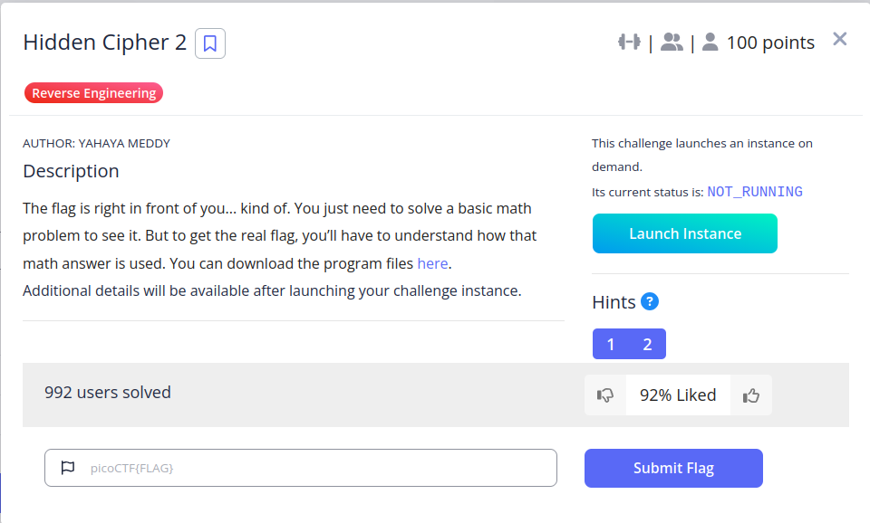

#### Hints

1. Focus on what the program does with your correct answer. Is it reused later?
2. Disassembling or decompiling tools (Ghidra, IDA) can help reveal the exact transformation on the flag.

```
nc crystal-peak.picoctf.net 50459
```


```
nc crystal-peak.picoctf.net 50459
What is 10 * 4? 40
Encoded flag values:
4480, 4200, 3960, 4440, 2680, 3360, 2800, 4920, 4360, 2080, 4640, 4160, 3800, 3920, 2040, 4160, 1960, 4400, 4000, 3800, 3960, 1960, 4480, 4160, 2040, 4560, 3800, 4080, 2240, 3960, 4040, 2200, 3880, 4000, 2160, 5000
```

Program runs:
encode_flag(flag, answer)

 Flag encoding
```
printf("%d", flag[i] * answer);
So each character becomes:
encoded_value = ASCII(flag_char) * answer
```

```python
enc = [4480,4200,3960,4440,2680,3360,2800,4920,4360,2080,4640,4160,
3800,3920,2040,4160,1960,4400,4000,3800,3960,1960,4480,4160,
2040,4560,3800,4080,2240,3960,4040,2200,3880,4000,2160,5000]

ans = 40

flag = ''.join(chr(x//ans) for x in enc)
print(flag)
```

```
picoCTF{m4th_b3h1nd_c1ph3r_f8ce7ad6}
```

---
